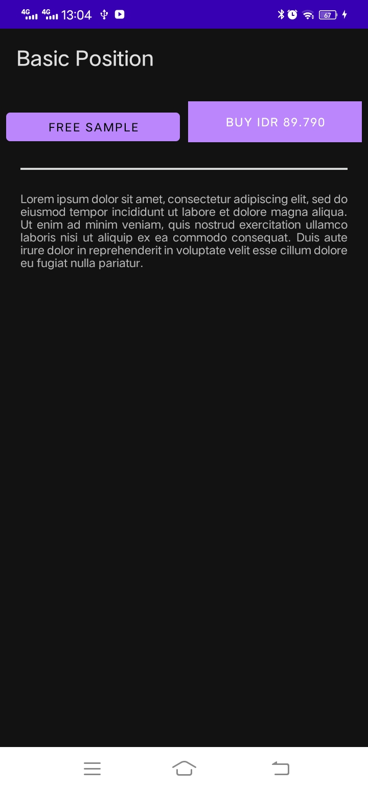

# 01 - Praktikum Constraint Layout

## Tujuan Pembelajaran

### 1. Mengetahui cara mengatur tampilan dalam tata letak kendala.
#

## Hasil Praktikum

### Berikut ini adalah bukti bahwa telah berhasil menyelesaikan praktikum 01-Constraint Layout dengan menggunakan android studio.    
 

#

-   [Link Kode Program Layout](../../src/01_constraint_layout/app/src/main/res/layout/activity_main.xml)
-   [Link Kode Program String](../../src/01_constraint_layout/app/src/main/res/values/strings.xml)
-   [Link Kode Program Color](../../src/01_constraint_layout/app/src/main/res/values/colors.xml)