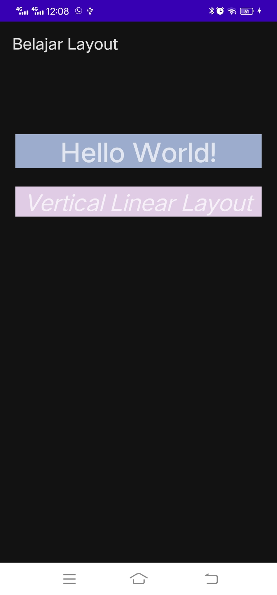

# 01 - Praktikum Linear Layout

## Tujuan Pembelajaran

### 1. Mengetahui cara membuat teks hello world menggunakan Textview pada layout linier vertikal.
#

## Hasil Praktikum

### Berikut ini adalah bukti bahwa telah berhasil menyelesaikan praktikum 01-Linear Layout dengan menggunakan android studio.    
 

#

-   [Link Kode Program Layout](../../src/01_linear_layout/app/src/main/res/layout/activity_main.xml)