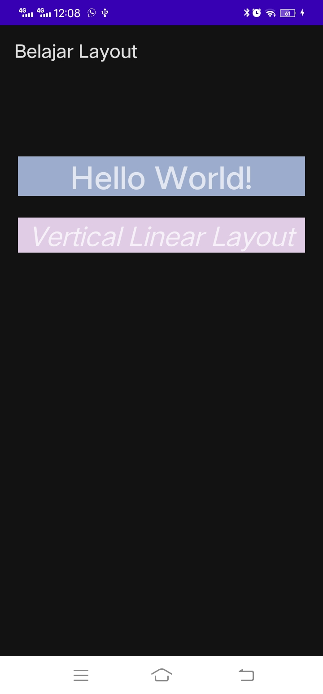
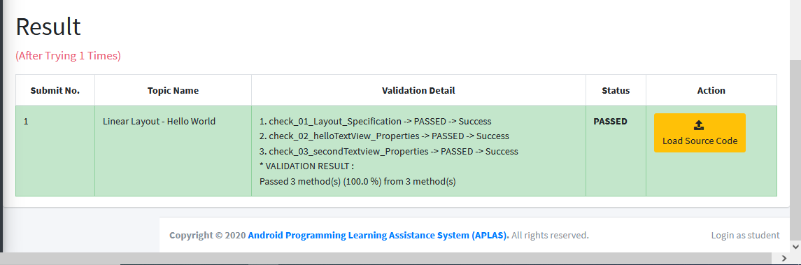
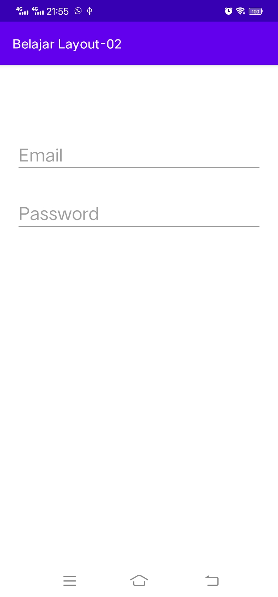
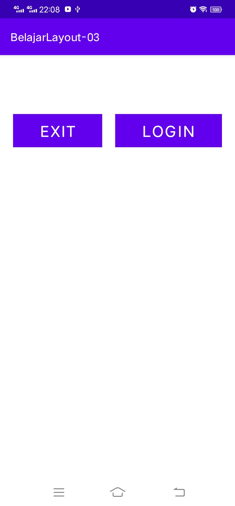
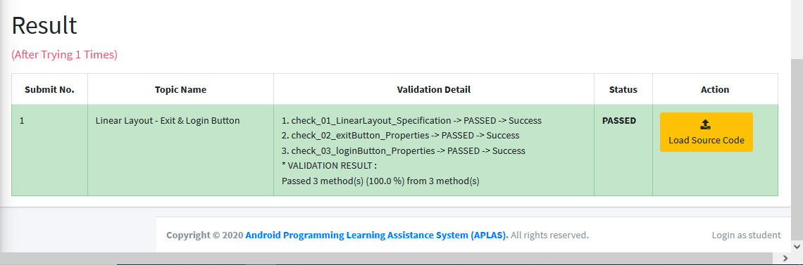
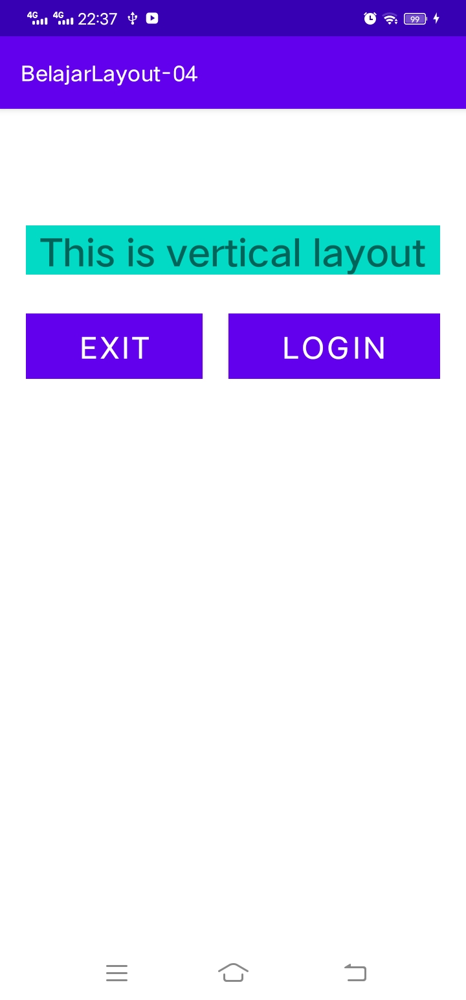
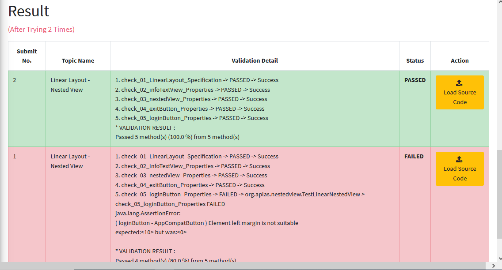
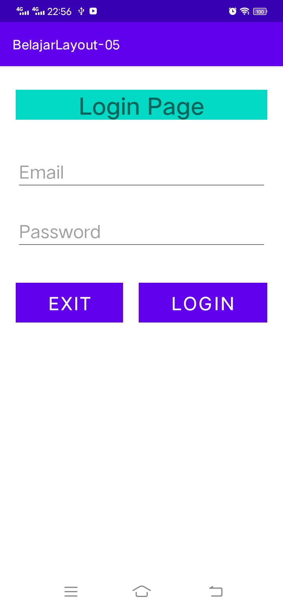
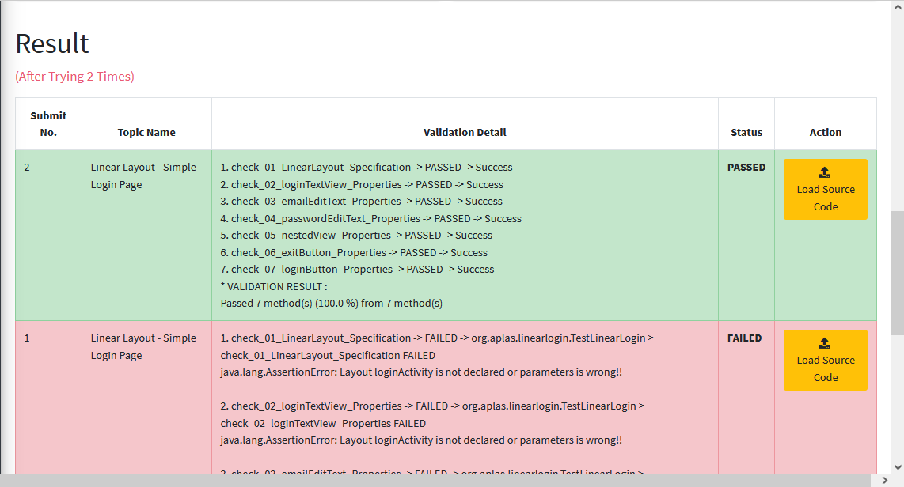

# 01 - Praktikum Linear Layout-Hello World

## Tujuan Pembelajaran

### 1. Mahasiswa akan membuat halaman login sederhana menggunakan LinearLayout. Pertama kita belajar membuat hello-world dengan TextView pada Linear Layout.
#

## Hasil Praktikum

### Berikut ini adalah bukti bahwa telah berhasil menyelesaikan Praktikum Linear Layout-Hello World dengan menggunakan android studio.    
 

## Hasil APLAS
Berikut ini bukti bahwa kode program yang diinputkan ke dalam APLAS menunjukkan status <b>PASSED</b>, yang artinya kode program sudah sesuai dengan apa yang diperintahkan.   

#
## -   [Link Kode Program Layout](../../src/linear_layout/01_linear_layout/app/src/main/res/layout/activity_main.xml)

#   

# 02 - Praktikum Linear Layout - Email & Password

## Tujuan Pembelajaran

### 1. Mahasiswa mengetahui cara membuat komponen yang dapat menerima masukan dari pengguna dengan          menggunakan EditText. Ini adalah dasar untuk membuat halaman yang membutuhkan masukan dari pengguna, seperti halaman login
#

## Hasil Praktikum

Berikut ini adalah bukti bahwa telah berhasil menyelesaikan Praktikum Linear Layout - Email & Password dengan menggunakan android studio.    
 

## Hasil APLAS
Berikut ini bukti bahwa kode program yang diinputkan ke dalam APLAS menunjukkan status <b>PASSED</b>, yang artinya kode program sudah sesuai dengan apa yang diperintahkan.   

#

## -   [Link Kode Program Layout](../../src/linear_layout/02_linear_layout/app/src/main/res/layout/activity_main.xml)

#   

# 03 - Praktikum Linear Layout - Exit & Login Button

## Tujuan Pembelajaran

### 1. Mahasiswa akan belajar bagaimana cara membuat tombol sederhana untuk aksi pengguna. Tombol exit untuk keluar dari halaman dan tombol login untuk melakukan login. Mari kita coba menggunakan horizontal linear layout.
#

## Hasil Praktikum

Berikut ini adalah bukti bahwa telah berhasil menyelesaikan Praktikum Linear Layout - Exit & Login Button dengan menggunakan android studio.    
 

## Hasil APLAS
Berikut ini bukti bahwa kode program yang diinputkan ke dalam APLAS menunjukkan status <b>PASSED</b>, yang artinya kode program sudah sesuai dengan apa yang diperintahkan.   

#

## -   [Link Kode Program Layout](../../src/linear_layout/03_linear_layout/app/src/main/res/layout/activity_main.xml)

#   

# 04 - Praktikum Linear Layout - Nested View

## Tujuan Pembelajaran

### 1. Mahasisiwa mampu membuat komponen bersarang, horizontal linear layout pada vertikal linear layout
#

## Hasil Praktikum

Berikut ini adalah bukti bahwa telah berhasil menyelesaikan Praktikum Linear Layout - Nested View dengan menggunakan android studio.    
 

## Hasil APLAS
Berikut ini bukti bahwa kode program yang diinputkan ke dalam APLAS menunjukkan status <b>PASSED</b>, yang artinya kode program sudah sesuai dengan apa yang diperintahkan.   

#

## -   [Link Kode Program Layout](../../src/linear_layout/04_linear_layout/app/src/main/res/layout/activity_main.xml)

#   

# 04 - Praktikum Linear Layout - Simple Login Page

## Tujuan Pembelajaran

### 1. Siswa akan membuat halaman login sederhana berdasarkan materi yang telah dipelajari sebelumnya. Dalam topik terakhir tentang linear layout ini, akan terlihat jelas apa yang telah kita pelajari
#

## Hasil Praktikum

Berikut ini adalah bukti bahwa telah berhasil menyelesaikan Praktikum Linear Layout - Simple Login Page dengan menggunakan android studio.    
 

## Hasil APLAS
Berikut ini bukti bahwa kode program yang diinputkan ke dalam APLAS menunjukkan status <b>PASSED</b>, yang artinya kode program sudah sesuai dengan apa yang diperintahkan.   

#

## -   [Link Kode Program Layout](../../src/linear_layout/05_linear_layout/app/src/main/res/layout/activity_main.xml)