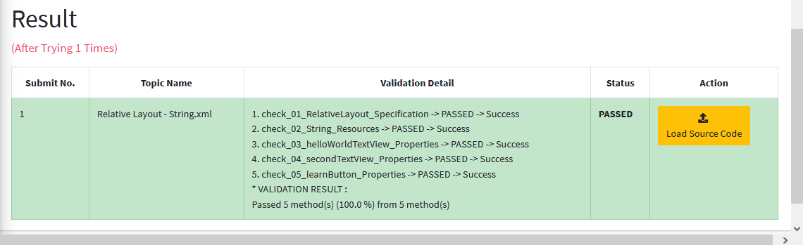
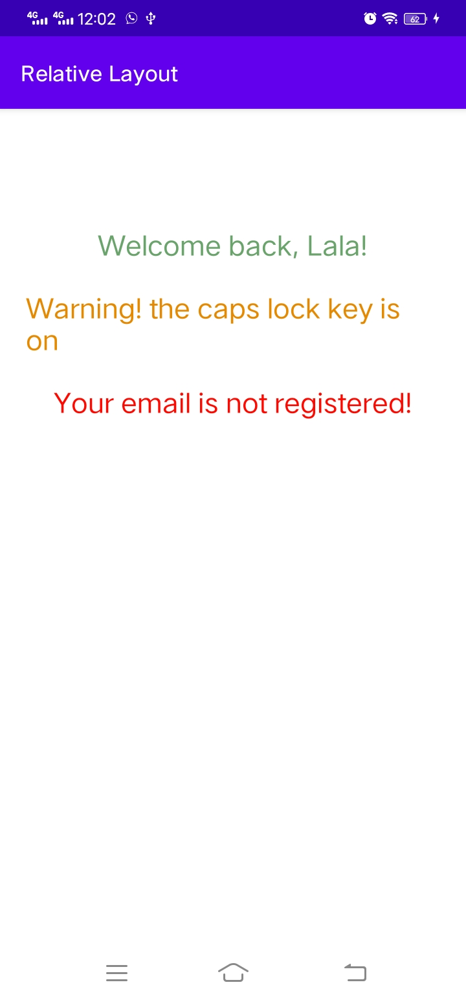
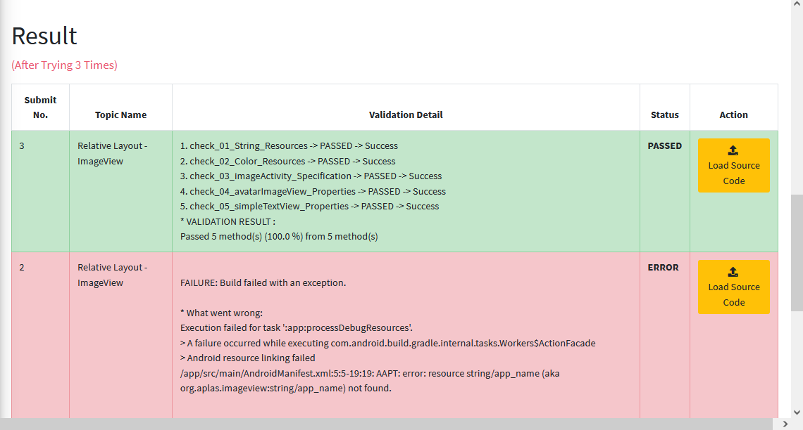
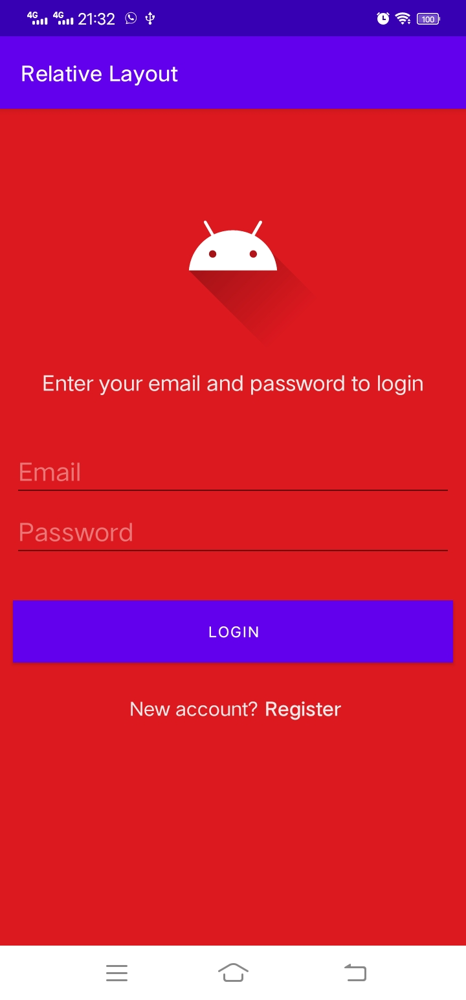

# 01 - Praktikum Relative Layout-String.xml

## Tujuan Pembelajaran

### 1. Mahasiswa mengetahui bagaimana cara menggunakan sumber daya string untuk teks sebuah komponen.
#

## Hasil Praktikum

Berikut ini adalah bukti bahwa telah berhasil menyelesaikan Praktikum Relative Layout-String.xml dengan menggunakan android studio.    
 

## Hasil APLAS
Berikut ini bukti bahwa kode program yang diinputkan ke dalam APLAS menunjukkan status <b>PASSED</b>, yang artinya kode program sudah sesuai dengan apa yang diperintahkan.   

#

## -   [Link Kode Program Layout](../../src/relative_layout/01_relative_layout/app/src/main/res/layout/activity_main.xml)
## -   [Link Kode Program String](../../src/relative_layout/01_relative_layout/app/src/main/res/values/strings.xml)
## -   [Link Kode Program Color](../../src/relative_layout/01_relative_layout/app/src/main/res/values/colors.xml)

#   

# 02 - Praktikum Relative Layout - Colors.xml

## Tujuan Pembelajaran

### 1. Mahasiswa tahu bagaimana menampilkan gambar dari image resources menggunakan imageview.
#

## Hasil Praktikum

Berikut ini adalah bukti bahwa telah berhasil menyelesaikan Praktikum Relative Layout - Colors.xml dengan menggunakan android studio.    
### Tampilan HP  
    

### Tampilan Emulator 
 

  

## Hasil APLAS
Berikut ini bukti bahwa kode program yang diinputkan ke dalam APLAS menunjukkan status <b>PASSED</b>, yang artinya kode program sudah sesuai dengan apa yang diperintahkan.   

#

## -   [Link Kode Program Layout](../../src/relative_layout/02_relative_layout/app/src/main/res/layout/activity_main.xml)
## -   [Link Kode Program String](../../src/relative_layout/02_relative_layout/app/src/main/res/values/strings.xml)
## -   [Link Kode Program Color](../../src/relative_layout/02_relative_layout/app/src/main/res/values/colors.xml)

#   

# 03 - Praktikum Relative Layout - ImageView

## Tujuan Pembelajaran

### 1. Mahasiswa mengetahui cara menampilkan gambar menggunakan imageview.
#

## Hasil Praktikum

Berikut ini adalah bukti bahwa telah berhasil menyelesaikan Praktikum Relative Layout - ImageView dengan menggunakan android studio.    
 

## Hasil APLAS
Berikut ini bukti bahwa kode program yang diinputkan ke dalam APLAS menunjukkan status <b>PASSED</b>, yang artinya kode program sudah sesuai dengan apa yang diperintahkan.   

#

## -   [Link Kode Program Layout](../../src/relative_layout/03_relative_layout/app/src/main/res/layout/activity_main.xml)
## -   [Link Kode Program String](../../src/relative_layout/03_relative_layout/app/src/main/res/values/strings.xml)
## -   [Link Kode Program Color](../../src/relative_layout/03_relative_layout/app/src/main/res/values/colors.xml)

#   

# 04 - Praktikum Relative Layout - Modern Login UI

## Tujuan Pembelajaran

### 1. Mahasiswa mengetahui cara membuat sebuah tampilan antarmuka login yang modern dengan relative layout.
#

## Hasil Praktikum

Berikut ini adalah bukti bahwa telah berhasil menyelesaikan Praktikum Relative Layout - Modern Login UI dengan menggunakan android studio.    
 

## Hasil APLAS
Berikut ini bukti bahwa kode program yang diinputkan ke dalam APLAS menunjukkan status <b>PASSED</b>, yang artinya kode program sudah sesuai dengan apa yang diperintahkan.   

#

## -   [Link Kode Program Layout](../../src/relative_layout/04_relative_layout/app/src/main/res/layout/activity_main.xml)
## -   [Link Kode Program String](../../src/relative_layout/04_relative_layout/app/src/main/res/values/strings.xml)
## -   [Link Kode Program Color](../../src/relative_layout/04_relative_layout/app/src/main/res/values/colors.xml)