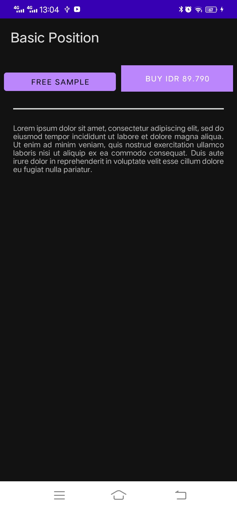
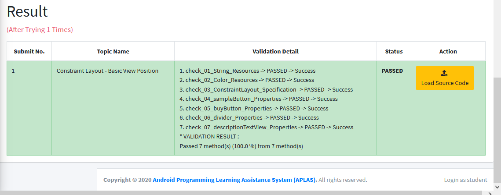
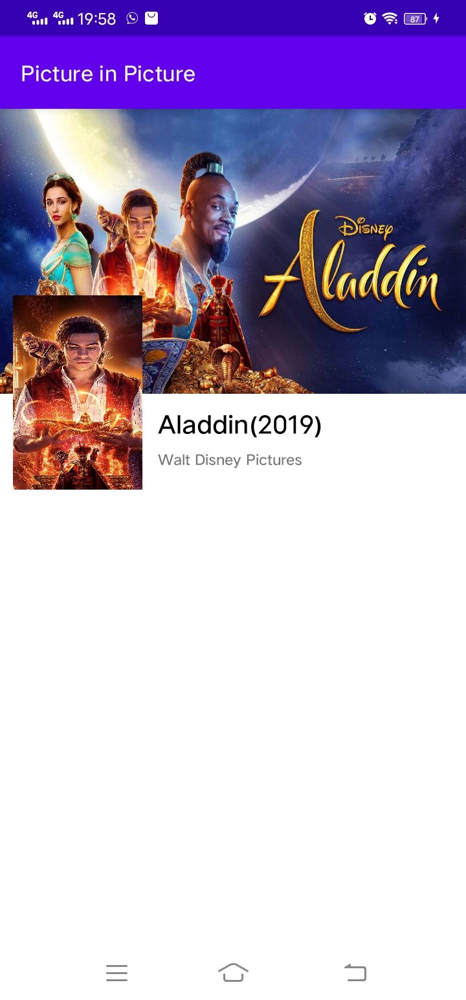
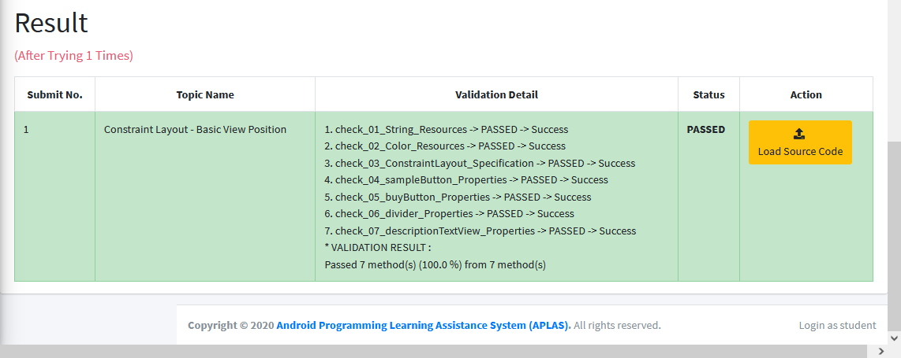
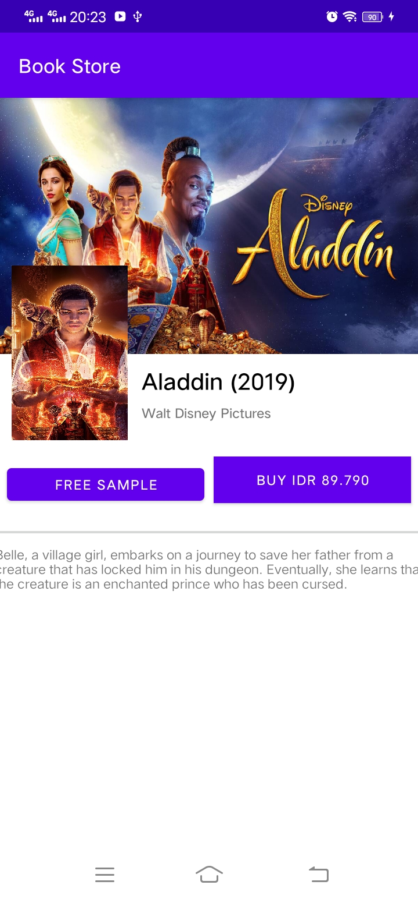
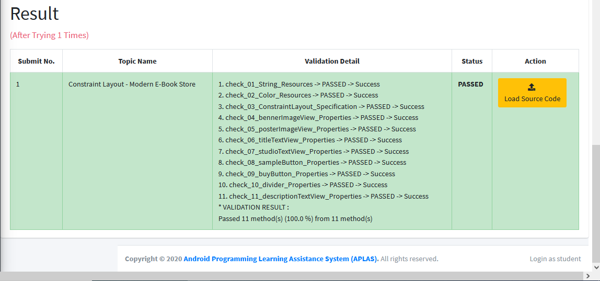

# 01 - Praktikum Constraint Layout-Basic View Position

## Tujuan Pembelajaran

### 1. Mahasiswa tahu bagaimana mengatur view dalam constraint layout.
#

## Hasil Praktikum

Berikut ini adalah bukti bahwa telah berhasil menyelesaikan Praktikum 01-Constraint Layout-Basic View Position dengan menggunakan android studio.    
 

## Hasil APLAS
Berikut ini bukti bahwa kode program yang diinputkan ke dalam APLAS menunjukkan status <b>PASSED</b>, yang artinya kode program sudah sesuai dengan apa yang diperintahkan.   

#

## -   [Link Kode Program Layout](../../src/constraint_layout/01_constraint_layout/app/src/main/res/layout/activity_main.xml)
## -   [Link Kode Program String](../../src/constraint_layout/01_constraint_layout/app/src/main/res/values/strings.xml)
## -   [Link Kode Program Color](../../src/constraint_layout/01_constraint_layout/app/src/main/res/values/colors.xml)

#   

# 02 - Praktikum Constraint Layout-Picture in Picture

## Tujuan Pembelajaran

### 1. Mahasiswa tahu bagaimana menampilkan gambar dari image resources menggunakan imageview.
#

## Hasil Praktikum

Berikut ini adalah bukti bahwa telah berhasil menyelesaikan Praktikum Constraint Layout-Picture in Picture dengan menggunakan android studio.    
 

## Hasil APLAS
Berikut ini bukti bahwa kode program yang diinputkan ke dalam APLAS menunjukkan status <b>PASSED</b>, yang artinya kode program sudah sesuai dengan apa yang diperintahkan.   

#

## -   [Link Kode Program Layout](../../src/constraint_layout/02_constraint_layout/app/src/main/res/layout/activity_main.xml)
## -   [Link Kode Program String](../../src/constraint_layout/02_constraint_layout/app/src/main/res/values/strings.xml)
## -   [Link Kode Program Color](../../src/constraint_layout/02_constraint_layout/app/src/main/res/values/colors.xml)

#   

# 03 - Praktikum Constraint Layout-Picture in Picture

## Tujuan Pembelajaran

### 1. Mahasiswa mengetahui cara membuat halaman aplikasi toko buku elektronik modern.
#

## Hasil Praktikum

Berikut ini adalah bukti bahwa telah berhasil menyelesaikan Praktikum Constraint Layout - Modern E-Book Store dengan menggunakan android studio.    
 

## Hasil APLAS
Berikut ini bukti bahwa kode program yang diinputkan ke dalam APLAS menunjukkan status <b>PASSED</b>, yang artinya kode program sudah sesuai dengan apa yang diperintahkan.   

#

## -   [Link Kode Program Layout](../../src/constraint_layout/03_constraint_layout/app/src/main/res/layout/activity_main.xml)
## -   [Link Kode Program String](../../src/constraint_layout/03_constraint_layout/app/src/main/res/values/strings.xml)
## -   [Link Kode Program Color](../../src/constraint_layout/03_constraint_layout/app/src/main/res/values/colors.xml)