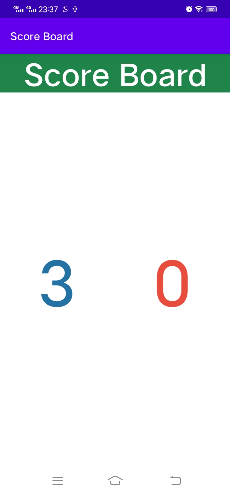

# 01 - Praktikum Grid Layout - Basic Layout

## Tujuan Pembelajaran

### 1. Mahasiswa mengetahui cara mengatur view pada grid layout.
#

## Hasil Praktikum

### Berikut ini adalah bukti bahwa telah berhasil menyelesaikan Praktikum Grid Layout - Basic Layout dengan menggunakan android studio.    
 

## Hasil APLAS
Berikut ini bukti bahwa kode program yang diinputkan ke dalam APLAS menunjukkan status <b>PASSED</b>, yang artinya kode program sudah sesuai dengan apa yang diperintahkan.   

#

## -   [Link Kode Program Layout](../../src/grid_layout/01_grid_layout/app/src/main/res/layout/activity_main.xml)
## -   [Link Kode Program String](../../src/grid_layout/01_grid_layout/app/src/main/res/values/strings.xml)
## -   [Link Kode Program Color](../../src/grid_layout/01_grid_layout/app/src/main/res/values/colors.xml)

#   

# 02 - Praktikum Grid Layout - Score Board

## Tujuan Pembelajaran

### 1. Mahasiswa mengetahui cara membuat papan skor dengan menggunakan grid layout.
#

## Hasil Praktikum

Berikut ini adalah bukti bahwa telah berhasil menyelesaikan Praktikum Grid Layout - Score Board dengan menggunakan android studio.    
 

## Hasil APLAS
Berikut ini bukti bahwa kode program yang diinputkan ke dalam APLAS menunjukkan status <b>PASSED</b>, yang artinya kode program sudah sesuai dengan apa yang diperintahkan.   

#

## -   [Link Kode Program Layout](../../src/grid_layout/02_grid_layout/app/src/main/res/layout/activity_main.xml)
## -   [Link Kode Program String](../../src/grid_layout/02_grid_layout/app/src/main/res/values/strings.xml)
## -   [Link Kode Program Color](../../src/grid_layout/02_grid_layout/app/src/main/res/values/colors.xml)

#   

# 03 - Praktikum Grid Layout - Photo Sharing

## Tujuan Pembelajaran

### 1. Mahasiswa mengetahui cara membuat aplikasi berbagi foto dengan menggunakan grid layout
#

## Hasil Praktikum

Berikut ini adalah bukti bahwa telah berhasil menyelesaikan Praktikum Grid Layout - Photo Sharing dengan menggunakan android studio.    
 

## Hasil APLAS
Berikut ini bukti bahwa kode program yang diinputkan ke dalam APLAS menunjukkan status <b>PASSED</b>, yang artinya kode program sudah sesuai dengan apa yang diperintahkan.   

#

## -   [Link Kode Program Layout](../../src/grid_layout/03_grid_layout/app/src/main/res/layout/activity_main.xml)
## -   [Link Kode Program String](../../src/grid_layout/03_grid_layout/app/src/main/res/values/strings.xml)
## -   [Link Kode Program Color](../../src/grid_layout/03_grid_layout/app/src/main/res/values/colors.xml)