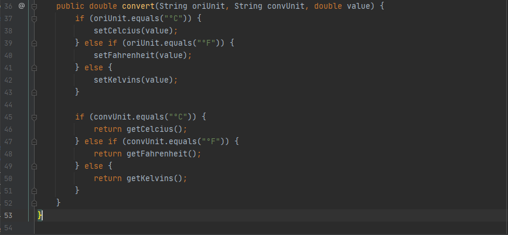
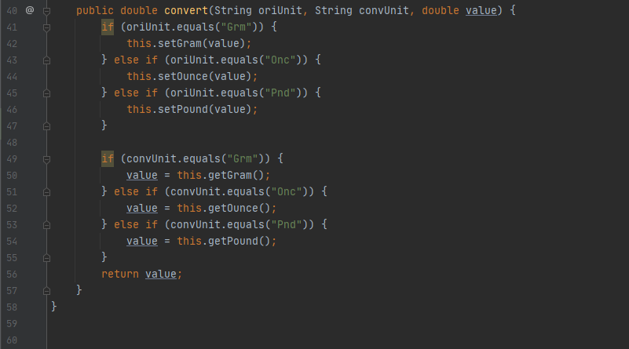
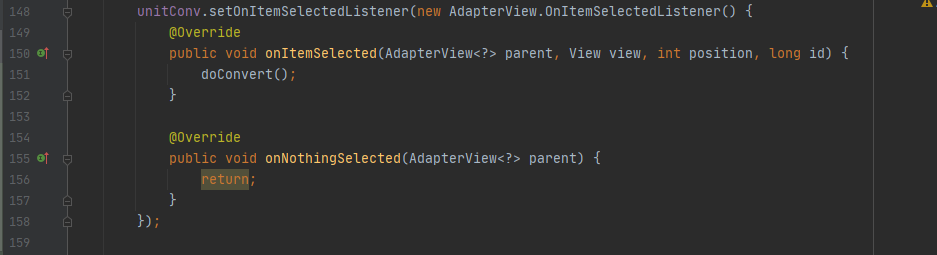
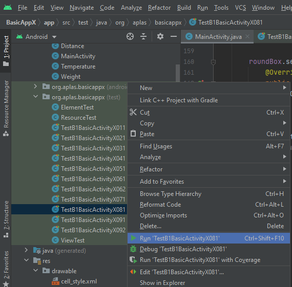

# 01 - B1:Java - Basic Activity Java Edition - for Android Studio 4.x

## Tujuan Pembelajaran

### 1. Mahasiswa mengetahui bagaimana cara membuat kelas suhu beserta cara mengkonversi satuannya.
### 2. Mahasiswa mengetahui bagaimana cara membuat kelas jarak beserta cara mengkonversi satuannya.
### 3. Mahasiswa mengetahui bagaimana cara membuat kelas berat beserta cara mengkonversi satuannya.
### 4. Mahasiswa mengetahui bagaimana cara membuat fields and methods di dalam main activity class.
### 5. Mahasiswa mengetahui activity lifecycle ketika on Create dan on Start.
### 6. Mahasiswa mengetahui tentang RadioGroup changed event dan bagaimana cara mengubah Spinner content.
### 7. Mahasiswa mengetahui bagaimana cara membuat sebuah method to do conversion.
### 8. Mahasiswa mengetahui bagaimana cara membuat events action untuk Button, Spinner, and CheckBox
### 9. Mahasiswa mengetahui bagaimana cara membuat new image element dan mengisinya saat formula checkbox checked.

## Hasil Praktikum

#

###    Untuk praktikum project B1 Basic Activity Java Edition 4.x ini sendiri akan ada 9 tahapan, yang mana masing - masing tahapan akan ada output tersendiri. Adapaun output - output tersebut ialah :
#

### 1. Make Temperature Class
Berikut ini adalah bukti bahwa telah berhasil menyelesaikan Praktikum 1 - Make Temperature Class dengan menggunakan android studio.  
Langkah Praktikum :
1. Pertama, kita hapus terlebih dahulu semua file yang ada di dalam folder “org.aplas.basicappx (test)”.  
2. Kemudian kita buat java class bernama <b>Temperature</b> di dalam folder yang sama dengan <b>MainActivity</b>   
 

3. Selanjutnya, kita buat attribute private bernama celcius dengan tipe data double.   
 

4. Membuat konstruktor dengan parameter kosong. Konstruktor ini akan memulai "celcius" field dengan nilai 0.   
 

5. Kemudian, kita buat tiga set method untuk menetapkan "celcius" field, seperti di bawah ini.   
 

6. Selanjutnya, kita buat tiga get method (fungsi) untuk mengembalikan nilai bertipe double dari proses konversi "celcius" field, seperti di bawah ini.   
 

7. Kita buat method(fungsi) baru lagi untuk proses konversi satuan suhu.   
 

8. Terakhir, kita inputkan file “TestB1BasicActivityX011.java” dan “ViewTest.java” ke dalam folder “org.aplas.basicappx (test)”. Lalu, kita coba eksekusi / running file “TestB1BasicActivityX011.java”  

#
### Hasil Bagian 1   

#

### 2. Make Distance Class
Berikut ini adalah bukti bahwa telah berhasil menyelesaikan Praktikum 2 - Make Distance Class dengan menggunakan android studio.  
Langkah Praktikum :
1. Pertama, kita buat java class bernama <b>Distance</b> di dalam folder yang sama dengan <b>MainActivity</b>.   
 

2. Selanjutnya, kita buat attribute private bernama meter dengan tipe data double.   
 

3. Membuat konstruktor dengan parameter kosong. Konstruktor ini akan memulai "meter" field dengan nilai 0.   
 

4. Kemudian, kita buat tiga set method untuk menetapkan "meter" field, seperti di bawah ini.   
 

5. Selanjutnya, kita buat tiga get method (fungsi) untuk mengembalikan nilai bertipe double dari proses konversi "meter" field, seperti di bawah ini.   
 

6. Kita buat method(fungsi) baru lagi untuk proses konversi satuan jarak.   
   
 

7. Terakhir, kita inputkan file “TestB1BasicActivityX021.java” ke dalam folder “org.aplas.basicappx (test)”. Lalu, kita coba eksekusi / running file “TestB1BasicActivityX021.java”  

#
### Hasil Bagian 2   

#

### 3. Make Weight Class
Berikut ini adalah bukti bahwa telah berhasil menyelesaikan Praktikum 3 - Make Weight Class dengan menggunakan android studio.  
Langkah Praktikum :
1. Pertama, kita buat java class bernama <b>Weight</b> di dalam folder yang sama dengan <b>MainActivity</b>.   
 

2. Selanjutnya, kita buat attribute private bernama gram dengan tipe data double.   
 

3. Membuat konstruktor dengan parameter kosong. Konstruktor ini akan memulai "gram" field dengan nilai 0.   
 

4. Kemudian, kita buat tiga set method untuk menetapkan "gram" field, seperti di bawah ini.   
 

5. Selanjutnya, kita buat tiga get method (fungsi) untuk mengembalikan nilai bertipe double dari proses konversi "gram" field, seperti di bawah ini.   
 

6. Kita buat method(fungsi) baru lagi untuk proses konversi satuan berat.   
  

7. Terakhir, kita inputkan file “TestB1BasicActivityX031.java” ke dalam folder “org.aplas.basicappx (test)”. Lalu, kita coba eksekusi / running file “TestB1BasicActivityX031.java”  

#
### Hasil Bagian 3   

#

### 4. Define fields and methods in Activity
Berikut ini adalah bukti bahwa telah berhasil menyelesaikan Praktikum 4 - Define fields and methods in Activity dengan menggunakan android studio.  
Langkah Praktikum :
1. Pertama, kita buat beberapa deskripsi fields ke dalam file <b>MainActivity</b>.  
 

2. Membuat 2 blank methods dengan spesifikasi seperti berikut. Lalu, kita berikan kondisi - kondisi sesuai dengan perintah yang ada.    
   
 

3. Terakhir, kita inputkan file “TestB1BasicActivityX041.java” ke dalam folder “org.aplas.basicappx (test)”. Lalu, kita coba eksekusi / running file “TestB1BasicActivityX041.java”  

#
### Hasil Bagian 4   

#

### 5. Make Override method in Activity
Berikut ini adalah bukti bahwa telah berhasil menyelesaikan Praktikum 5 - Make Override method in Activity dengan menggunakan android studio.  
Langkah Praktikum :
1. Pertama, kita buka file MainActivity.java, kemudian kita coba tambahkan kode program berikut ke dalam method “onCreate” yang sudah ada sebelumnya.   
 

2. Selanjutnya, kita buat method “onStart” di bawah method “onCreate”. Lalu, kita definisikan method tersebut dengan menggunakan kode - kode program berikut.   
 

3. Terakhir, kita inputkan file “TestB1BasicActivityX051.java” ke dalam folder “org.aplas.basicappx (test)”. Lalu, kita coba eksekusi / running file “TestB1BasicActivityX051.java”  

#
### Hasil Bagian 5   

#

### 6. Create RadioGroup event
Berikut ini adalah bukti bahwa telah berhasil menyelesaikan Praktikum 6 - Create RadioGroup event dengan menggunakan android studio.  
Langkah Praktikum :
1. Pertama, kita buka file string.xml, kemudian kita coba tambahkan beberapa item di dalam tag string-array, seperti dibawah ini.   
 

2. Selanjutnya, kita tambahkan file “distance.png” dan “weight.png” yang ada di folder Supplement ke dalam folder “drawable”.   

3. Kemudian, buka file MainActivity.java dan buat sebuah event ketika "unitType" Radiogroup di dalam metode "onCreate". Selain itu, di langkah ketiga ini kita juga buat beberapa kondisi case di dalam method "onCreate".
  

4. Terakhir, kita inputkan file “ElementTest.java”, “TestB1BasicActivityX061.java, dan “TestB1BasicActivityX062.java” ke dalam folder “org.aplas.basicappx (test)”. Lalu, kita coba eksekusi / running file “TestB1BasicActivityX061.java”  

#
### Hasil Bagian 6   

#

### 7. Make method to convert units
Berikut ini adalah bukti bahwa telah berhasil menyelesaikan Praktikum 7 - Make method to convert units dengan menggunakan android studio.  
Langkah Praktikum :
1. Pertama, kita buka file MainActivity.java dan kita coba tambahkan method "doConvert".  

2. Selanjutnya, kita tambahkan beberapa syntax ke dalam method "doConvert", seperti berikut ini. Yang mana untuk syntax itu sendiri kita buat dengan berpacu pada perintah yang ada di dalam GuideDocuments.   

3. Terakhir, kita inputkan file “TestB1BasicActivityX071.java” ke dalam folder “org.aplas.basicappx (test)”. Lalu, kita coba eksekusi / running file “TestB1BasicActivityX071.java”  

#
### Hasil Bagian 7   

#

### 8. Create Widget event listener
Berikut ini adalah bukti bahwa telah berhasil menyelesaikan Praktikum 8 - Create Widget event listener dengan menggunakan android studio.  
Langkah Praktikum :
1. Pertama, kita tambahkan event listener untuk membantu mendeteksi event ketika “convertButton”di klik. Untuk bagian ini sendiri kita letakkan di bawah “unitType.setOnCheckedChangeListener” yang ada sudah kita tambahkan di dalam MainActivity.java sebelumnya.   

2. Selanjutnya, kita tambahkan event listener untuk membantu mendeteksi event ketika “oriList” di klik.    

3. Kemudian, kita coba tambahkan kembali  event listener untuk membantu mendeteksi event ketika “convList” di klik.    

4. Tambahkan kembali  event listener untuk membantu mendeteksi event ketika “roundBox” di klik.    

5. Terakhir kita inputkan file “TestB1BasicActivityX081.java” ke dalam folder “org.aplas.basicappx (test)”. Lalu, kita coba eksekusi / running file “TestB1BasicActivityX081.java”  

#
### Hasil Bagian 8   

#

### 9. Create ImageView and event
Berikut ini adalah bukti bahwa telah berhasil menyelesaikan Praktikum 9 - Create ImageView and event dengan menggunakan android studio.  
Langkah Praktikum :
1. Pertama, kita copy file “formula.png” yang ada di folder Supplement ke dalam folder “drawable”. 

2. Selanjutnya, di dalam activity_layout.xml tepatnya di bawah TableLayout, kita buat sebuah ImageView dengan id “imgFormula”.    

3. Kemudian, kita coba tambahkan juga event listener untuk membantu mendeteksi event ketika “formBox” di klik.    

4. Terakhir kita inputkan file “TestB1BasicActivityX091.java” dan “TestB1BasicActivityX092.java” ke dalam folder “org.aplas.basicappx (test)”. Lalu, kita coba eksekusi / running file “TestB1BasicActivityX081.java”  

#
### Hasil Bagian 9   

#

## -   [Link Kode Program Layout](../../src/project/02_projectB1/app/src/main/res/layout/activity_main.xml)
## -   [Link Kode Program String](../../src/project/02_projectB1/app/src/main/res/values/strings.xml)
## -   [Link Kode Program Distance](../../src/project/02_projectB1/app/src/main/java/org/aplas/basicappx/Distance.java)
## -   [Link Kode Program Temperature](../../src/project/02_projectB1/app/src/main/java/org/aplas/basicappx/Temperature.java)
## -   [Link Kode Program Weight](../../src/project/02_projectB1/app/src/main/java/org/aplas/basicappx/Weight.java)
## -   [Link Kode Program MainActivity](../../src/project/02_projectB1/app/src/main/java/org/aplas/basicappx/MainActivity.java)