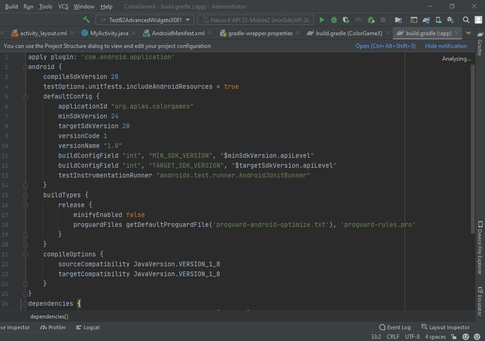
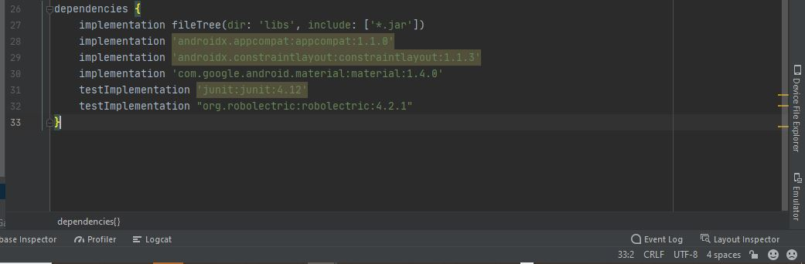
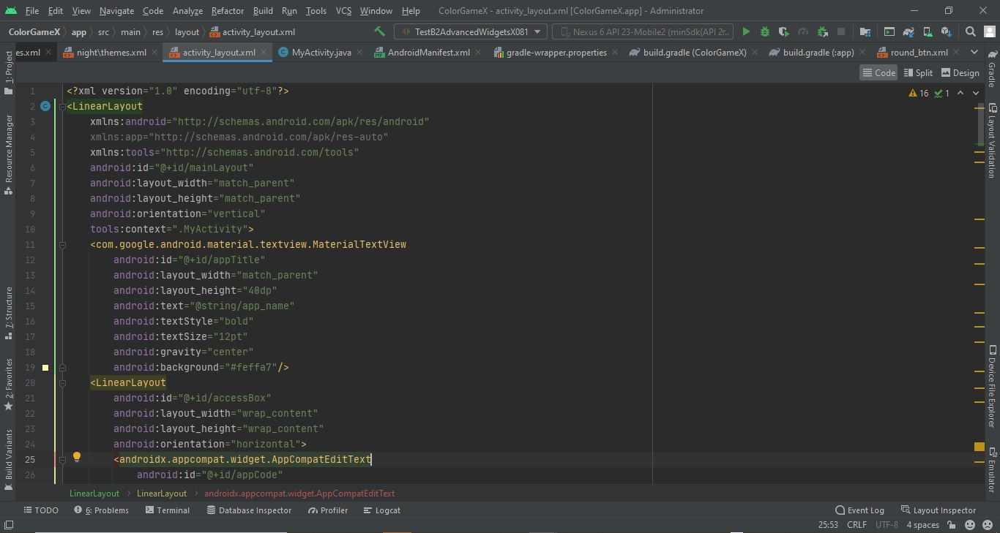
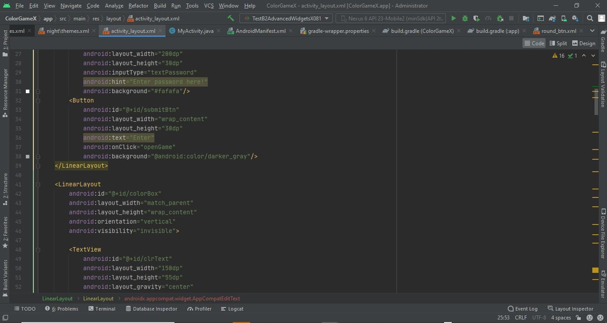
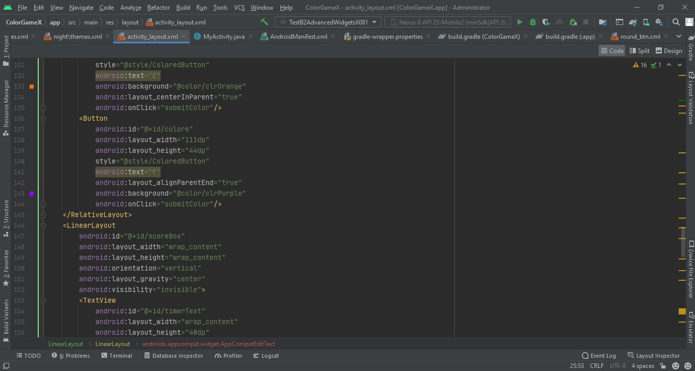
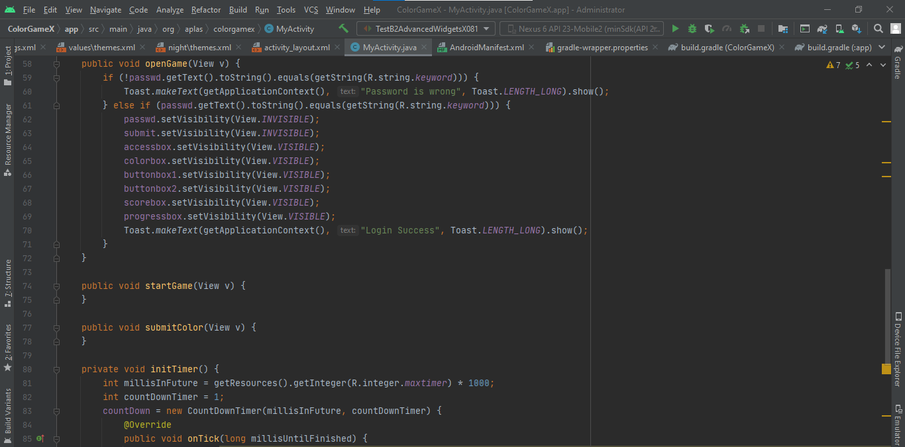
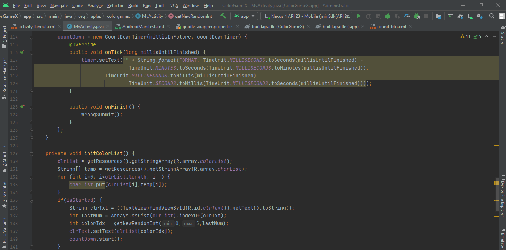

# 01 - B2 Java-AdvancedWidgetsJavaEdition-forAndroidStudio4.x

## Tujuan Pembelajaran

### 1. Mahasiswa akan memulai proyek untuk membuat aplikasi Android game sederhana. Pertama dengan konfigurasi proyek dan konfigurasi resource.
### 2. Mahasiswa mengetahui tentang style, theme, dan drawable vector image.
### 3. Mahasiswa akan membuat UI untuk proyek Color Game dengan beberapa atribut onClick.
### 4. Mahasiswa akan mendeklarasikan field yang dibutuhkan oleh aplikasi dan menentukan method untuk memeriksa validitas saat memasuki permainan.
### 5. Mahasiswa mengetahui bagaimana cara kerja dari Countdowntimer.
### 6. Mahasiswa akan memahami bagaimana mengakses array dari resource dan memasukkannya ke dalam List dan Hashtable.
### 7. Mahasiswa akan memahami bagaimana memulai timer dalam sebuah permainan.
### 8. Mahasiswa akan memahami bagaimana cara menghandle waktu dan menghitung skor.

## Hasil Praktikum

#

###    Untuk praktikum project B1 Basic Activity Java Edition 4.x ini sendiri akan ada 8 tahapan, yang mana masing - masing tahapan akan ada output tersendiri. Adapaun output - output tersebut ialah :
#

### 1. Define color, string, and integer resources
Berikut ini adalah bukti bahwa telah berhasil menyelesaikan Praktikum 1 - Define color, string, and integer resources dengan menggunakan android studio.  
Langkah Praktikum :
1. Pertama, kita buat project baru bernama ColorGameX.  
   
2. Kemudian kita tambahkan beberapa colors ke dalam file color.xml 
   

3. Selanjutnya, kita juga deklarasikan strings di dalam file string.xml, seperti berikut.  
   

4. Menambahkan kode program ke dalam file themes.xml sesuai dengan perintah di Guide.  
   

5. Kemudian, kita buat file MyActivity di dalam folder org.aplase.colorgame dengan detail konfigurasi seperti berikut.   
   

6. Selanjutnya, kita buka AndroidManifest.xml dan kemudian kita coba sesuaikan konfigurasinya dengan Guide yang ada.  
   

7. Merubah isian file build.graddle (Module: app) menjadi seperti berikut. 
  
  

8. Terakhir, kita inputkan file “TestB1BasicActivityX011.java”, “TestB1BasicActivityX012.java”, “ElementTest.java”, “ResourceTest.java” dan “ViewTest.java” ke dalam folder “org.aplas.colorgamex (test)”. Lalu, kita coba eksekusi / running file “TestB1BasicActivityX011.java” dan “TestB1BasicActivityX011.java”. 

#
### Hasil Bagian 1   
  

#

### 2. Define theme, style, and drawable resources
Berikut ini adalah bukti bahwa telah berhasil menyelesaikan Praktikum 2 - Define theme, style, and drawable resources dengan menggunakan android studio.  
Langkah Praktikum :
1. Pertama, kita copy file <b>“ic_resicon.xml</b> yang sudah disediakan ke dalam folderd drawable.  

2. Selanjutnya kita buat round button di dalam drawable, lalu kita inputkan kode ke dalamnya, seperti berikut.  
   

3. Di dalam file round_btn.xml tepatnya di tag shape, kita coba tambahkan kode - kode berikut.  
    
 Maka, akan diperoleh hasil seperti berikut : 
    

4. Kemudian, kita tambahkan style baru bernama <b>ColoredButton</b> di dalam file themes.xml tanpa parent.  
   

5. Selanjutnya, kita juga tambahkan style baru di dalam file yang sama dengan nama “ProgressBar” dengan parent "@android:style/Widget.SeekBar". 
   

7. Terakhir, kita inputkan file “ElementTest.java, ResourceTest.java, ViewTest.java, TestB2AdvancedWidgetsX021.java ke dalam folder “org.aplas.colorgamex (test)”. Lalu, kita coba eksekusi / running file “TestB1BasicActivityX021.java”. 
#
### Hasil Bagian 2   

#

### 3. Completing the layout (UI)
Berikut ini adalah bukti bahwa telah berhasil menyelesaikan Praktikum 3 - Completing the layout (UI) dengan menggunakan android studio.  
Langkah Praktikum :
1. Pertama, kita buka file <b>activity_layout.xml</b>, lalu kita tambahkan beberapa kode program seperti berikut : 
   a)  
     
   b)  
     
   c) 
     
   d)  
     
   e) 
     
   f) 
     
   g) 
     
   h) 
     
   i) 
     

2. Kita coba tambahkan 3 method ke dalam file “MyActivity.java”, diantaranya method openGame, startGame, SubmitColor.
3. Terakhir, kita inputkan file “TestB2AdvancedWidgetsX031.java” ke dalam folder “org.aplas.colorgamex (test)”. Lalu, kita coba eksekusi / running file “TestB2AdvancedWidgetsX031.java”. 

#
### Hasil Bagian 3   
a) Hasil 1

b)  

#

### 4.Create validation method
Berikut ini adalah bukti bahwa telah berhasil menyelesaikan Praktikum 4 - Create validation method dengan menggunakan android studio.  
Langkah Praktikum :
1. Untuk praktikum ke-4 kali ini kita akan berfokus pada file MyActivity.xml. Dimana kita akan mencoba memasukkan beberapa kode program ke dalam file MyActivity.xml. Adapun detailnya adalah seperti berikut.
 
  

2. Selanjutnya, kita inputkan “TestB2AdvancedWidgetsX041.java” ke dalam folder “org.aplas.colorgamex (test)”. Lalu, kita coba eksekusi / running file “TestB2AdvancedWidgetsX041.java”. 

#
### Hasil Bagian 4   

#

### 5. Create method to start CountDownTimer
Berikut ini adalah bukti bahwa telah berhasil menyelesaikan Praktikum 5 - Create method to start CountDownTimer dengan menggunakan android studio.  
Langkah Praktikum :
1. Pertama, kita buka file MainActivity.java, kemudian kita coba tambahkan kode program berikut :
 
 
 
 

2. Terakhir, kita inputkan file “TestB1BasicActivityX061.java” ke dalam folder “org.aplas.colorgamex (test)”. Lalu, kita coba eksekusi / running file “TestB1BasicActivityX061.java”  

#
### Hasil Bagian 5   

#

### 6. Create method to load color data to List and Hashtable
Berikut ini adalah bukti bahwa telah berhasil menyelesaikan Praktikum 6 - Create method to load color data to List and Hashtable dengan menggunakan android studio.  
Langkah Praktikum :
1.Pertama, kita buka file MainActivity.java, kemudian kita coba tambahkan kode program berikut :
 
 
 

2. Terakhir, kita inputkan file “TestB1BasicActivityX051.java” ke dalam folder “org.aplas.colorgamex (test)”. Lalu, kita coba eksekusi / running file “TestB1BasicActivityX051.java”  

#
### Hasil Bagian 6   

#

### 7.Create method to start game
Berikut ini adalah bukti bahwa telah berhasil menyelesaikan Praktikum 7 - Create method to start game dengan menggunakan android studio.  
Langkah Praktikum :
1. Pertama, kita buka file MainActivity.java, kemudian kita coba tambahkan kode program berikut :
 
 
 
 
 

2. Terakhir, kita inputkan file “TestB1BasicActivityX071.java” ke dalam folder “org.aplas.colorgamex (test)”. Lalu, kita coba eksekusi / running file “TestB1BasicActivityX071.java”  

#
### Hasil Bagian 7   

#

### 8. Create Widget event listener
Berikut ini adalah bukti bahwa telah berhasil menyelesaikan Praktikum 7 - Create method to start game dengan menggunakan android studio.  
Langkah Praktikum :
1. Pertama, kita buka file MainActivity.java, kemudian kita coba tambahkan kode program berikut :
 
 
 
 
 
 

2. Terakhir kita inputkan file “TestB1BasicActivityX081.java” ke dalam folder “org.aplas.colorgamex (test)”. Lalu, kita coba eksekusi / running file “TestB1BasicActivityX081.java”  

#
### Hasil Bagian 8   

#

## -   [Link Kode Program Layout](../../src/project/03_projectB2/app/src/main/res/layout/activity_layout.xml)
## -   [Link Kode Program String](../../src/project/03_projectB2/app/src/main/res/values/strings.xml)
## -   [Link Kode Program Color](../../src/project/03_projectB2/app/src/main/res/values/colors.xml)
## -   [Link Kode Program MyActivity](../../src/project/03_projectB2/app/src/main/java/org/aplas/colorgamex/MyActivity.java)
## -   [Link Kode Program Android Manifest](../../src/project/03_projectB2/app/src/main/AndroidManifest.xml)
## -   [Link Kode Program Build Gradle](../../src/project/03_projectB2/app/build.gradle)
## -   [Link Kode Program Round Button](../../src/project/03_projectB2/app/src/main/res/drawable/round_btn.xml)

D:\PROJECT\FILE GITHUB CLOUD & MOBILE\mobile-3E-05\src\project\03_projectB2\app\src\main\res\layout