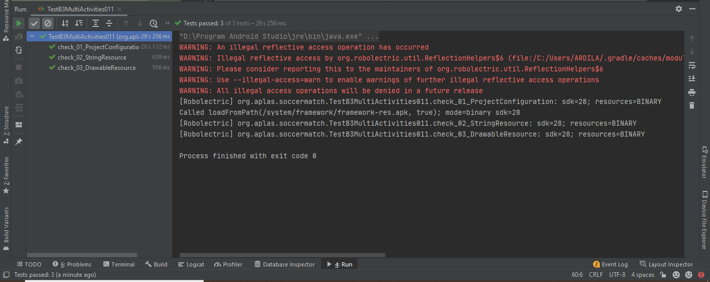
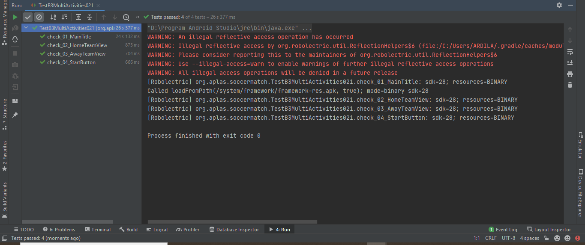
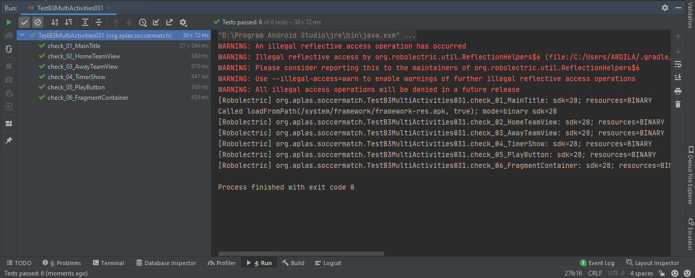
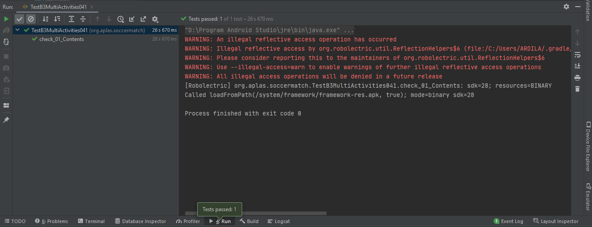
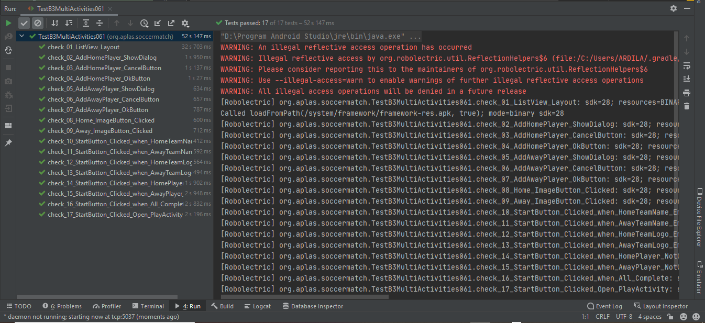
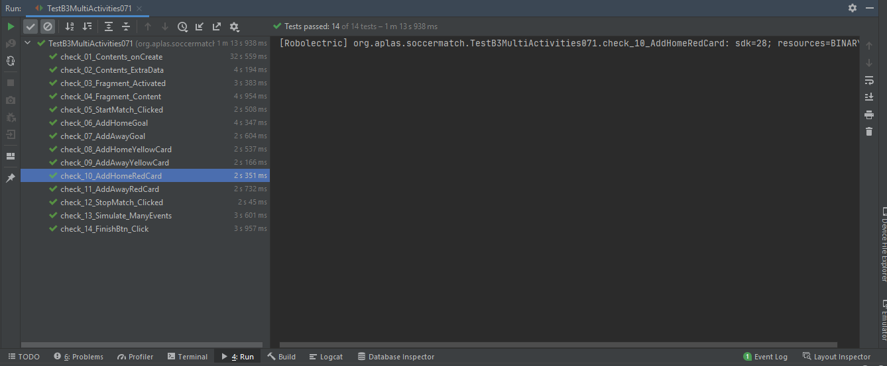
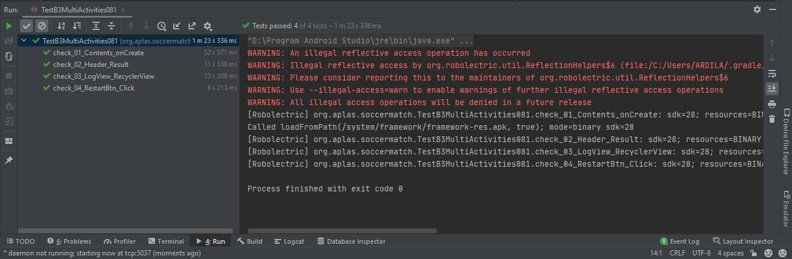

# 01 - B3 Java - Multiple Activities Java Edition - for Android Studio 4.x

## Tujuan Pembelajaran

### 1. Mahasiswa akan memulai proyek Android untuk membuat aplikasi Android yang berisi beberapa kegiatan yang berjudul Pertandingan Sepak Bola. Pertama dengan project configuration dan resource configuration.
### 2. Mahasiswa akan mulai mendesain Main layout sebagai first layout yang berisi CardView, ListView, ImageButton, TextView, EditText, and Button.
### 3. Mahasiswa akan mulai mendesain Play layout sebagai second layout yang berisi CardView, ImageButton, ImageView, TextView, Fragment Container, and Button.
### 4. Mahasiswa akan mulai mendesain Log layout sebagai third layout yang berisi TextView, RecyclerView, and Button.
### 5. Mahasiswa akan mulai mendesain layout of list, layout of dialog, layout of match log, and layout of footer fragment.
### 6. Mahasiswa akan mulai memprogram untuk MainActivity. Tugas ini akan memperkenalkan cara menangani ListView, membuka image selector intent, menampilkan dialog, dan membuka intent lain.
### 7. Mahasiswa akan mulai memprogram untuk PlayActivity. Tugas ini akan memperkenalkan:
- cara mengumpulkan variabel lewat Intent,
- cara menggunakan Timer dengan Handler,
- cara menggunakan Menu Popup, dan
- cara membuat dan mengakses Fragment.
### 8. Mahasiswa akan mulai memprogram untuk LogActivity. Tugas ini akan memperkenalkan: 
- cara mengumpulkan variabel lewat Intent,
- cara menggunakan RecyclerView,
- cara menggunakan adaptor Tampilan, dan
- cara memuat array sebagai tambahan Intent.

## Hasil Praktikum

#

###    Untuk praktikum project B3 Java - Multiple Activities Java Edition - for Android Studio 4.x ini sendiri akan ada 8 tahapan, yang mana masing - masing tahapan akan ada output tersendiri. Adapun output - output tersebut ialah :
#

### 1. Starting the project and configuring the resource
Berikut ini adalah bukti bahwa telah berhasil menyelesaikan Praktikum 1 - Starting the project and configuring the resource dengan menggunakan android studio.  
  

### 2. Designing the MainLayout
Berikut ini adalah bukti bahwa telah berhasil menyelesaikan Praktikum 2 - Designing the MainLayout dengan menggunakan android studio.  
  

### 3. Designing the PlayLayout
Berikut ini adalah bukti bahwa telah berhasil menyelesaikan Praktikum 3 - Designing the PlayLayout dengan menggunakan android studio.  
  

### 4. Designing the LogLayout
Berikut ini adalah bukti bahwa telah berhasil menyelesaikan Praktikum 4 - Designing the LogLayout dengan menggunakan android studio.  
  

### 5. Designing the Fragment, RecyclerView, and ListView
Berikut ini adalah bukti bahwa telah berhasil menyelesaikan Praktikum 5 - Designing the Fragment, RecyclerView, and ListView dengan menggunakan android studio.  
  

### 6. Building the MainActivity
Berikut ini adalah bukti bahwa telah berhasil menyelesaikan Praktikum 6 - Building the MainActivity dengan menggunakan android studio.  
  

### 7. Building the PlayActivity
Berikut ini adalah bukti bahwa telah berhasil menyelesaikan Praktikum 7 - Building the PlayActivity dengan menggunakan android studio.  
  

### 8. Building the LogActivity
Berikut ini adalah bukti bahwa telah berhasil menyelesaikan Praktikum 8 - Building the LogActivity dengan menggunakan android studio.  
  

