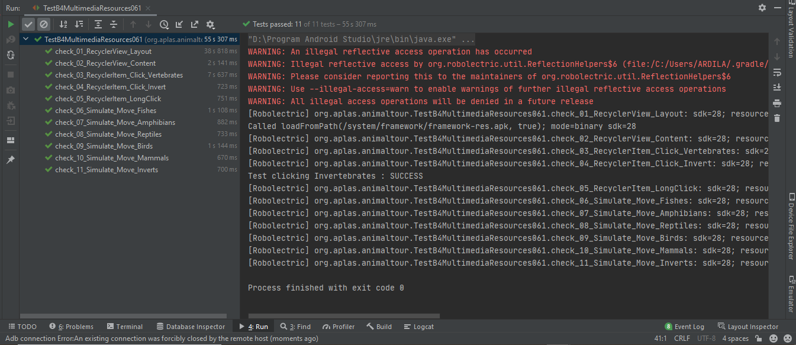
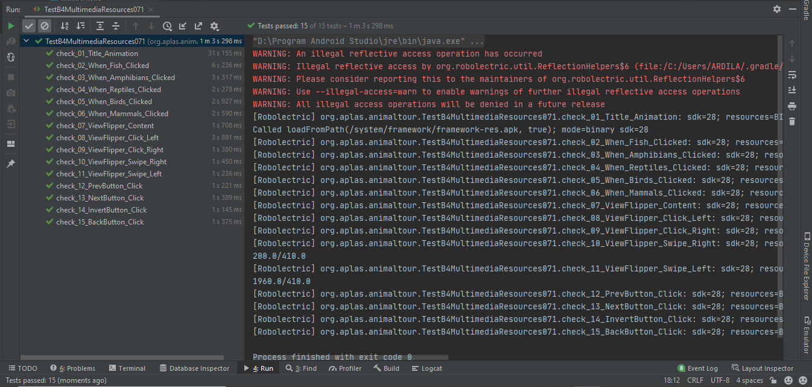
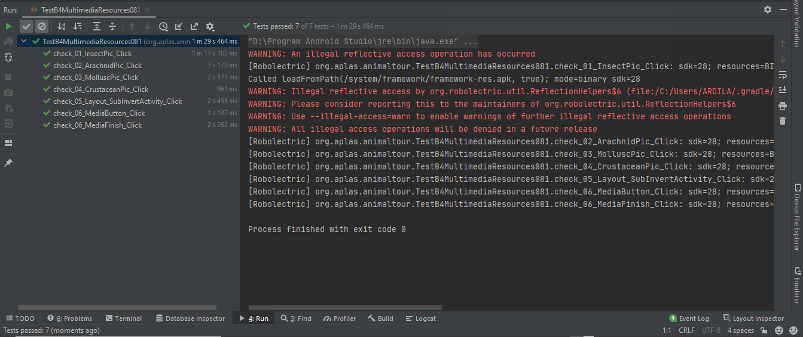

# 01 - B4 Java - Multimedia Resources Java Edition

## Tujuan Pembelajaran

### 1. Mahasiswa akan memulai proyek Android untuk membuat aplikasi Android yang berisi beberapa kegiatan yang berjudul Animal Tour Pertama dengan project configuration dan resource configuration.
### 2. Mahasiswa akan mulai mendesain Main layout sebagai first layout yang berisi RecyclerView dengan drawable animations.
### 3. Mahasiswa akan mulai mendesain Media layout sebagai second layout yang berisi Video Player, YouTube Player, and ViewFlipper.
### 4. Mahasiswa akan mulai mendesain Invert layout sebagai third layout yang berisi GridLayout untuk menampilkan gambar grid.
### 5. Mahasiswa akan mulai mendesain layout SubInvert sebagai fourth yang berisi detail hewan invertebrata.
### 6. Mahasiswa akan mulai menulis kode untuk MainActivity yang menampilkan data di RecyclerView dan membuatnya dapat beralih secara dinamis.
### 7. Mahasiswa akan mulai menulis kode untuk MediaActivity yang berisi Video Player, YouTube Player, dan ViewFlipper. Mahasiswa juga akan belajar bagaimana menggunakan gerakan.
### 8. Mahasiswa akan mulai menulis kode untuk InvertActivity yang berisi GridLayout untuk gambar hewan Invertebrata. Mahasiswa juga akan menulis kode untuk SubInvertActivity.

## Hasil Praktikum

#

###    Untuk praktikum projectB4 Java - Multimedia Resources Java Edition ini sendiri akan ada 8 tahapan, yang mana masing - masing tahapan akan ada output tersendiri. Adapun output - output tersebut ialah :
#

### 1. Start AnimalTour project and configure the Resources
Berikut ini adalah bukti bahwa telah berhasil menyelesaikan Praktikum 1 - Start AnimalTour project and configure the Resources dengan menggunakan android studio.  
  

### 2. Design MainActivity layout
Berikut ini adalah bukti bahwa telah berhasil menyelesaikan Praktikum 2 - Design MainActivity layout dengan menggunakan android studio.  
  

### 3. Design MediaActivity layout
Berikut ini adalah bukti bahwa telah berhasil menyelesaikan Praktikum 3 - Design MediaActivity layout dengan menggunakan android studio.  
  

### 4. Design InvertActivity layout
Berikut ini adalah bukti bahwa telah berhasil menyelesaikan Praktikum 4 - Design InvertActivity layout dengan menggunakan android studio.  
  

### 5. Design SubInvertActivity layout
Berikut ini adalah bukti bahwa telah berhasil menyelesaikan Praktikum 5 - Design SubInvertActivity class dengan menggunakan android studio.  
  

### 6. Develop MainActivity class
Berikut ini adalah bukti bahwa telah berhasil menyelesaikan Praktikum 6 - Develop MainActivity class dengan menggunakan android studio.  
  

### 7. Develop MediaActivity class
Berikut ini adalah bukti bahwa telah berhasil menyelesaikan Praktikum 7 - Develop MediaActivity class dengan menggunakan android studio.  
  

### 8. Develop InvertActivity class with SubInvertActivity class
Berikut ini adalah bukti bahwa telah berhasil menyelesaikan Praktikum 8 - Develop InvertActivity class with SubInvertActivity class dengan menggunakan android studio.  
  