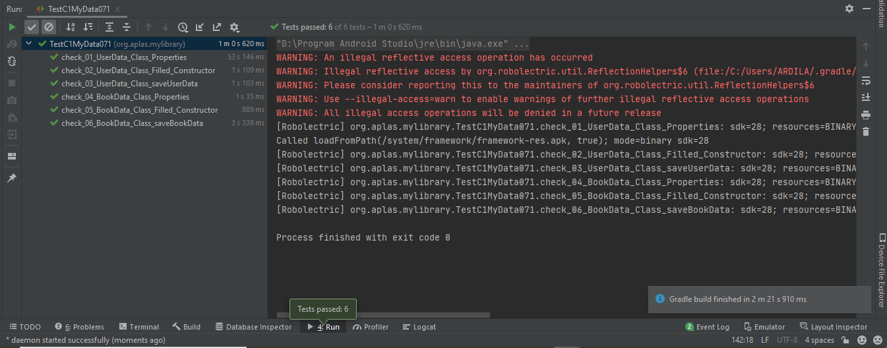

# 01 - CI BASIC DATA STORAGE JAVA EDITION

## Tujuan Pembelajaran

### 1. Student will start an Android project to create an Android application that contains several activities entitled MyLibrary. First with project configuration and resource configuration.
### 2.Student will start to design the Main layout as first layout.
### 3.Student will start to design the Input Data layout.
### 4. Student will start to design the Show Data Layout.
### 5. Student will create share preferences for user’s data and book’s data.
### 6. MStudent can create input data and show the data with data binding.
### 7. Students can create data binding models.
### 8. Student will create a button to pick color for background.
### 9. Student will create to check data in “InputDataActivity” page.
### 10. Student will create effect in some content in “ShowDataActivity” page.

## Hasil Praktikum

#

###    Untuk praktikum projectC1 BASIC DATA STORAGE JAVA EDITION ini sendiri akan ada 10 tahapan, yang mana masing - masing tahapan akan ada output tersendiri. Adapun output - output tersebut ialah :
#

### 1. Starting the project and configuring the resource
Berikut ini adalah bukti bahwa telah berhasil menyelesaikan Praktikum 1 - Starting the project and configuring the resource dengan menggunakan android studio.  
  

### 2.  	Designing the UI of MainActivity
Berikut ini adalah bukti bahwa telah berhasil menyelesaikan Praktikum 2 - D 	Designing the UI of MainActivity dengan menggunakan android studio.  
  

### 3. Designing the UI of InputDataActivity
Berikut ini adalah bukti bahwa telah berhasil menyelesaikan Praktikum 3 - Designing the UI of InputDataActivity dengan menggunakan android studio.  
  

### 4. Designing the UI of ShowDataActivity
Berikut ini adalah bukti bahwa telah berhasil menyelesaikan Praktikum 4 - Designing the UI of ShowDataActivity dengan menggunakan android studio.  
  

### 4. Designing the UI of ShowDataActivity
Berikut ini adalah bukti bahwa telah berhasil menyelesaikan Praktikum 4 - Designing the UI of ShowDataActivity dengan menggunakan android studio.  
  

### 4. Designing the UI of ShowDataActivity
Berikut ini adalah bukti bahwa telah berhasil menyelesaikan Praktikum 4 - Designing the UI of ShowDataActivity dengan menggunakan android studio.  
  

### 5. Creating SharedPreferences for user data and book data.
Berikut ini adalah bukti bahwa telah berhasil menyelesaikan Praktikum 5 - Creating SharedPreferences for user data and book data. dengan menggunakan android studio.  
  

### 6.Developing input data and show data with data binding
Berikut ini adalah bukti bahwa telah berhasil menyelesaikan Praktikum 6 - Developing input data and show data with data binding dengan menggunakan android studio.  
  

### 7. Creating data binding models for MVVM architecture.
Berikut ini adalah bukti bahwa telah berhasil menyelesaikan Praktikum 7 - Creating data binding models for MVVM architecture dengan menggunakan android studio.  
  

### 8. Developing the source code for MainActivity
Berikut ini adalah bukti bahwa telah berhasil menyelesaikan Praktikum 8 - Developing the source code for MainActivity dengan menggunakan android studio.  
  

### 9. Developing the source code for InputDataActivity
Berikut ini adalah bukti bahwa telah berhasil menyelesaikan Praktikum 9 - Developing the source code for InputDataActivity dengan menggunakan android studio.  
  

### 10. Developing the source code for ShowDataActivity
Berikut ini adalah bukti bahwa telah berhasil menyelesaikan Praktikum 10 - Developing the source code for ShowDataActivity dengan menggunakan android studio.  
  
