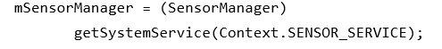

# PERTEMUAN 12

## RANGKUMAN

#

### <b>Motion and Position Sensors</b>
#

<b>A. Overview Motion and Position Sensors</b>

- Motion dan Position sensor berfungsi untuk memantau posisi perangkat di ruang masing - masing.
- Motion dan Position akan mengembalikan array multi-dimensi dari nilai sensor untuk setiap SensorEvent.  
Contoh : Accelerometer returns acceleration force data for 3 coordinate axes (x, y, z) relative to device.

<b>B. Coordinate System</b>
- Device Coordinate System(Sistem koordinat perangkat), beberapa sensor menggunakan sistem koordinat perangkat relatif terhadap perangkat. Contoh : Akselerometer
- Earth coordinate system (Sistem koordinat bumi), Sensor lain menggunakan sistem koordinat bumi relatif terhadap permukaan bumi.Contoh : Magnetometer.  

 1. Device Coordinate 1</b>  
  

Relatif terhadap perangkat fisik terlepas dari posisi perangkat di dunia :  
- <b>x</b>, mendatar ke kanan.
- <b>y</b>, vertikal ke arah atas.
- <b>z</b>, ke arah luar layar.
- <b>z negatif</b>, di belakang layar.

 2. Device Coordinate 2</b>  
  

Relatif terhadap layar perangkat saat perangkat dalam keadaan orientasi default. 
- Sumbu tidak berubah ketika orientasi berubah akibat adanya rotasi.
- Aplikasi harus mengubah data sensor yang masuk agar sesuai dengan rotasi.

 3. Earth Coordinate</b>  
  

- <b>y</b>, menunjuk ke utara magnet di sepanjang permukaan bumi.
- <b>x</b>90 derajat dari y, menunjuk ke arah timur.
- <b>y</b>, vertikal ke arah atas.
- <b>z</b>, meluas ke luar angkasa.
- <b>z negatif</b>, meluas ke bawah ke tanah.  

<b>C. Determining Device Orientation</b> 

1. Device Coordinate</b>  
  

- Posisi perangkat relatif terhadap koordinat Bumi (y menunjuk ke utara magnetis).
- Untuk menentukan posisinya dengan menggunakan akselerometer dan sensor medan geomagnetik yang mana berpacu pada metode yang ada di SensorManager. 

2. Komponen Orientasi </b>  
 
<b>Azimuth</b>, sudut antara arah kompas perangkat dan utara magnet.  
 
<b>Pitch</b>, sudut antara bidang yang sejajar dengan layar perangkat dan bidang yang sejajar dengan tanah.  
 
<b>Roll</b>, Sudut antara bidang yang tegak lurus dengan layar perangkat dan bidang yang tegak lurus dengan tanah.  

3. SensorManager methods
   - <b>getRotationMatrix()</b> menghasilkan matriks rotasi dari akselerometer dan sensor medan geomagnetik. Contoh : Menerjemahkan data sensor dari koordinat perangkat ke koordinat Bumi.
   - <b>getOrientation()</b> menggunakan matriks rotasi untuk menghitung sudut orientasi perangkat.  

4. Contoh Determine orientation  
 

<b>D. Understanding device rotation </b>

1. Transformasikan Koordinat Untuk Rotasi 
Jika aplikasi menggambar tampilan berdasarkan data sensor:
   - Layar atau sistem koordinat aktivitas berputar dengan perangkat. 
   - Sistem koordinat sensor tidak berputar. 
   - Perlu mengubah koordinat sensor menjadi koordinat aktivitas.  

2. Menangani Perangkat dan Aktivitas Rotasi
   - Query Orientasi perangkat = <b>getRotationMatrix()</b>
   - Memetakan ulang matriks rotasi dari data sensor ke koordinat aktivitas dengan <b>remapCoordinateSystem()</b>.  

3. Returned from getRotation() 
   - ROTATION_0: Default (potret untuk ponsel)
   - ROTATION_90: Samping (lanskap untuk ponsel)
   - ROTATION_180: Terbalik (jika perangkat memungkinkan)
   - ROTATION_270: Samping ke arah yang berlawanan

4. Contoh Handle device rotation 
 
#
 
#
 

<b>E. Using motion sensors</b> 

7. Rotation-vector sensor

1. Motion sensors 
Gerakan biasanya merupakan cerminan dari: 
    -  Masukan <b>pengguna langsung</b> relatif terhadap perangkat/aplikasi (kemudi mobil dalam game, dll.) 
    - Gerakan perangkat relatif terhadap Bumi. 
    
<b>Noted</b> : Sensor gerak digunakan dengan sensor lain untuk menentukan posisi perangkat relatif terhadap Bumi.  

2. Accelerometer 
a. <b>TYPE_ACCELEROMETER</b> mengukur percepatan di sepanjang 3 sumbu perangkat (x, y, z) termasuk gravitasi. 
b. <b>Akselerasi tanpa gravitasi</b>:menggunakan TYPE_LINEAR_ACCELERATION. 
c. <b>Gaya gravitasi tanpa percepatan</b>: gunakan TYPE_GRAVITY. 
d. <b>TYPE_GYROSCOPE</b> mengukur laju rotasi (radian/detik).  

3. Accelerometer event data  
 

4. Contoh Accelerometer 
 

5. Gravity and Gyroscope Sensors 
Sepanjang 3 sumbu perangkat (x, y, z):
   - <b>TYPE_GRAVITY</b> mengukur gravitasi tanpa percepatan. 
   - <b>TYPE_GYROSCOPE</b> mengukur laju rotasi (radian/detik).  

6. Gravity Event Data  
 

7. Rotation-vector Sensor 
   - <b>TYPE_ROTATION_VECTORM</b>memberikan orientasi sehubungan dengan Bumi yang dikoordinasikan sebagai unit quaternion. 
   - Sensor perangkat lunak yang mengintegrasikan data dari akselerometer, magnetometer, dan giroskop (jika tersedia). 
   - Cara yang efisien dan akurat untuk menentukan orientasi perangkat. 

8. Step Counter and Step Detectorbr>
   - <b>TYPE_STEP_COUNTER</b>mengukur langkah pengguna sejak reboot terakhir. 
   - Untuk menghemat baterai, kita bisa gunakan JobScheduler untuk mengambil nilai saat ini dengan menghitung langkah pada interval tertentu. 
   - <b>TYPE_STEP_DETECTOR</b>: sensor perangkat keras yang memicu peristiwa untuk setiap langkah. 
   - Contoh : Aplikasi BatchStepSensor  

<b>F.  Using position sensors</b> 
1. Geomagnetic (magnetometer) 
   - <b>TYPE_MAGNETIC_FIELD</b> mengukur kekuatan medan magnet di sekitar perangkat pada masing-masing 3 sumbu (x, y, z), termasuk medan magnet Bumi. 
   - Satuan dalam <b>mikrotesla (uT)</b>
   - Temukan posisi perangkat sehubungan dengan dunia luar (kompas).

2. Orientation 
   - <b>TYPE_ORIENTATION</b> tidak digunakan lagi di API 8. 
   - Untuk orientasi perangkat yang akurat (pilih salah satu):  
    a. getRotationMatrix() dan getOrientation(). 
    b. Gunakan sensor vektor rotasi dengan TYPE_ROTATION_VECTOR.  

#

### <b>Location</b>
#

<b>A. Setting up Google Play services</b> 
1. Setting up Google Play services 

   a. Install Google Repository in Android Studio. 
   b. Select Tools > Android > SDK Manager. 
   c. Select the SDK Tools tab. 
   d. Expand Support Repository. 
   e. Select Google Repository and click OK. 

2. Adding Google Play to your project 
 

<b>B. Location permissions</b> 
1. Users choose to share their location 
a. Dari Marshmallow dan seterusnya:  
 
   - Pengguna memberikan atau menolak akses ke lokasi mereka untuk setiap aplikasi. 
   - Pengguna dapat mengubah izin akses kapan saja. 
   -  Aplikasi dapat meminta pengguna untuk memberikan izin untuk menggunakan lokasi.  

    b. Untuk aplikasi yang dibuat sebelum Marshmallow:  
 
   -   Pengguna memberikan izin sebelum menginstal. 
   - Setelah instalasi, pengguna tidak dapat mengubah izin akses. 
   - Aplikasi dapat memeriksa apakah izin telah diberikan.  

2. Requesting location permission  
Aplikasi harus meminta izin lokasi :  
 - <b>ACCESS_COARSE_LOCATION</b> untuk lokasi yang akurat di dalam blok kota. 
 - <b>ACCESS_FINE_LOCATION</b> untuk mendapatkan lokasi yang tepat.  

3. Request permission in manifest 
 

4. Requesting permission at run time 
   - Pengguna dapat mencabut izin kapan saja
   - Periksa izin setiap kali aplikasi Anda menggunakan lokasi
   - Detail dan contoh: Meminta Izin saat Runtime  

5. Check/request permission  
 

6. Get user's response  
 

7. Check if request was granted  
  

<b>B. Get device location</b> 
1. Untuk meminta lokasi terakhir yang diketahui :  
  
2. Requesting last known location  
a. Success Listener  
  
b. Failure Listener  
  

3. Get latitude and longitude  
  

<b>C. Geocoding and reverse geocoding</b> 
   - <b>Geocode</b>: Ubah alamat jalan yang dapat dibaca manusia menjadi garis lintang/bujur. 
   - <b>Reverse geocode</b>: Ubah lat/long menjadi alamat jalan yang dapat dibaca manusia. 

1. Use the Geocoder class  
  
2. Geocoder backend service 
   - Gunakan isPresent() untuk memeriksa apakah ada implementasi.  
   - Metode kueri geocoder mengembalikan daftar kosong jika tidak ada layanan backend. 
3. Reverse geocoding coordinates  
  
4. Geocoding address into coordinates  
  

<b>D. Creating a LocationRequest object</b>  
 
1. Getting Llocation updates, gunakan <b>LocationRequest</b> untuk menyetel parameter permintaan pembaruan lokasi. 

2. LocationRequest parameters 
a. <b>setInterval()</b>: Menyetel seberapa sering aplikasi membutuhkan pembaruan. 
b. <b>setFastestInterval()</b>: Menetapkan batas kecepatan pembaruan untuk mencegah limpahan data. 
c. <b>setPriority()</b>: Menetapkan prioritas dan sumber permintaan. 

3. Request priority values  
 

4.  Contoh Create LocationRequest   
  

<b>E. Requesting location updates</b>  
1. Requesting location updates. 
   - Gunakan <b>LocationRequest</b> dengan <b>FusedLocationProviderClient</b> 
2. Steps to start location updates. 
   - Buat objek <b>LocationRequest</b>. 
   - Override <b>LocationCallback.onLocationResult()</b>. 
   - Gunakan <b>requestLocationUpdates()</b> pada FusedLocationProviderClient untuk memulai pembaruan rutin. 
   - Gunakan requestLocationUpdates() untuk memulai pembaruan rutin :  
      - Berikan <b>LocationRequest dan LocationCallback</b>. 
      - Pembaruan lokasi dikirimkan ke <b>onLocationResult()</b>. 
3. Using LocationCallback  
  

<b>F. Working with user settings</b>  
1. Steps to check device settings 
- Gunakan <b>LocationRequest</b> dengan <b>FusedLocationProviderClient</b> 
a. Buat objek <b>LocationSettingsRequest</b>. 
b. Buat objek <b>SettingsClient</b>. 
c. Gunakan <b>checkLocationSettings()</b> untuk cek kecocokan pengaturan perangkat dengan <b>LocationRequest
</b>. 
d. Gunakan <b>OnFailureListener</b> untuk tahu ketika pengaturan tidak cocok dengan <b>LocationRequest</b>. 
2. Create a LocationSettingsRequest  
  
3. Create a SettingsClient  
  
4. See if device settings match request  
  
5. Catch when settings don't match 
a. Gunakan <b>OnFailureListener</b> untuk tahu ketika pengaturan tidak cocok dengan <b>LocationRequest</b>. 
b. Pengecualian diteruskan ke <b>onFailure()</b> berisi Status. 
c. Jika setelan tidak cocok, maka statusnya adalah <b>LocationSettingsStatusCodes.RESOLUTION_REQUIRED</b>.  

<b>F. Handle the user's decision</b> 
1. Override <b>onActivityResult()</b> in <b>Activity</b>.  
2. Pastikan requestCode cocok dengan konstan di <b>startResolutionForResult()</b>.  

#

### <b>Sensors</b>
#

<b>A. Types of sensors</b> 
1. Jenis sensor yang didukung oleh platform Android : 
    - Hardware-based sensors, komponen fisik dibangun ke dalam perangkat, turunkan data dengan langsung mengukur properti yang spesifik.  Contoh: sensor cahaya, sensor jarak, magnetometer, akselerometer 
    - Software-based sensors (perangkat lunak: sensor virtual atau komposit), berasal data dari satu atau lebih sensor perangkat keras. 
Contoh: percepatan linier, orientasi.

2. Sensor availability 
    - Sebagian besar perangkat memiliki akselerometer dan magnetometer. 
    - Beberapa perangkat memiliki barometer atau termometer. 
    - Perangkat dapat memiliki lebih dari satu sensor dari jenis tertentu. 
    - Ketersediaan bervariasi antara versi Android. 

3. Emulating sensors 
   a. Sensors and Android emulator  
 
   Kontrol sensor virtual untuk pengujian: Di emulator, gunakan panel di sisi kanan, pilih ... > Sensor virtual. 
     - Accelerometer tab, uji aplikasi untuk perubahan posisi atau orientasi perangkat. 
     - Additional sensors tab, simulasikan sensor posisi dan lingkungan.  

   b. Emulator: Accelerometer tab  
     - Mensimulasikan gerakan perangkat seperti kemiringan dan rotasi. 
     - Mensimulasikan cara akselerometer dan magnetometer merespons. 
     - Bidang Nilai yang dihasilkan menunjukkan nilai
 aplikasi dapat mengakses.  

<b>B. Android sensor framework</b> 
1.  Important framework classes 
     - Sensor: Tentukan kemampuan sensor tertentu. 
     - SensorEvent: Info tentang acara, termasuk data sensor mentah. 
     - SensorEventListener: Menerima pemberitahuan tentang peristiwa sensor. 
       - Ketika sensor memiliki data baru. 
       - Ketika akurasi sensor berubah. 

2. Sensor class types and typical uses  
  

<b>C. Discovering sensors and capabilities</b> 
1. Identify sensors  
  
2. Get list of sensors  
  
3. Identify sensor features 
   - getResolution() untuk resolusi sensor. 
   - getMaximumRange() untuk jangkauan pengukuran maksimum. 
   - getPower() untuk kebutuhan daya sensor. 
   - getVendor() dan getVersion() untuk mengoptimalkan sensor yang berbeda atau versi sensor yang berbeda. 
   - getMinDelay() untuk menentukan kecepatan maksimum di mana sensor dapat memperoleh data. 
4. Contoh Identify magnetometer sensor  
  

<b>D. Handling different sensor configurations</b> 
1. Use Google Play filters to target devices  
  
2. Detecting sensors at runtime, Gunakan <b>getDefaultSensor()</b> dan berikan konstanta tipe untuk sensor tertentu seperti TYPE_PROXIMITY, TYPE_GYROSCOPE, atau TYPE_GRAVITY.  

<b>E. Monitoring sensor events</b> 
1. Contoh SensorEventListener and callbacks  
  
2. Contoh Changes to light sensor  
  

#

### <b>Places API</b>
#

<b>A. Setting up location permission</b> 
a. Request permission at runtime. 
b. Permission to get locationbr  
 
c. Check/request permission  
 
d. Get user's response  
 
e. Check if request was granted  
 

<b>B. Using place details</b> 
1. Dapatkan objek Tempat: 
   - Panggil PlaceDetectionClient.getCurrentPlace() 
   - Tambahkan PlacePicker dan panggil PlacePicker.getPlace() 
   - Panggil GeoDataClient.getPlaceById() 

2. Retrieve data from a Place object  
 
 

3. Contoh Get place ID   
  

<b>C. Using PlacePicker</b> 
1. Add listener to fragment  
 
2. Launch PlacePicker  
 
3. Get user-selected place  
 

<b>D. Getting nearby places</b> 
   - Get places at device location  
  
  
  

<b>E. Using Place Autocomplete</b> 
   - Tambahkan elemen UI PlaceAutocomplete ke aplikasi.  
   - Mengembalikan saran tempat berdasarkan query penelusuran pengguna. 
   - Dapatkan prediksi tempat secara terprogram untuk membuat UI khusus. 

1. Cara kerja saran tempat 
   - Pengguna memasukkan istilah pencarian. 
   - Dialog pencarian menyajikan daftar tempat yang diprediksi. 
   - Jika pengguna membuat pilihan, tempat dikembalikan. 
   - Aplikasi dapat menggunakan tempat untuk mendapatkan detail. 

2. Mendapatkan prediksi tempat di UI khusus 
- Dapatkan daftar prediksi nama tempat dan/atau alamat dengan memanggil <b>GeoDataClient.getAutocompletePredictions()</b>
- parameter lulus:
  - Query String dengan teks pengguna. 
  - bjek LatLngBounds (membiaskan hasil ke area tertentu). 
  - Opsional: Pelengkapan OtomatisFilter dengan jenis tempat untuk membatasi hasil. 
- <b>getAutocompletePredictions()</b> mengacu pada batas query berjenjang. 
   
<b>F. Getting place details</b> 
1. Ambil detail tempat 
a. getFullText(CharacterStyle matchStyle) mengembalikan deskripsi teks lengkap dan berfokus pada bagian yang cocok dengan pencarian (gunakan CharacterStyle atau null). 
b. getPrimaryText(CharacterStyle matchStyle) mengembalikan teks utama, biasanya sebuah nama. 
c. getSecondaryText(CharacterStyle matchStyle) mengembalikan teks tambahan. 

 2. Request foto tempat untuk ditampilkan 
 a. Panggil GeoDataClient.getPlacePhotos() dan berikan string dengan ID tempat. 
 b. Panggil getPhotoMetadata() pada instance PlacePhotoMetadataResult. 

#

### <b>Mapping</b>
#
<b>A. Displaying map in layout</b> 
1. Display map in layout 
Untuk menambahkan peta ke tata letak, gunakan: 
a. MapView
b. MapFragment 
Contoh :   
  

2. Contoh Create map  
  

3. Contoh onMapReady()  
  

<b>B. Setting the map type</b> 
1. Map types  
 
a. Normal: Peta jalan 
b. Satelit: Foto satelit 
c. Hibrida: Satelit dan jalan raya 
d. Medan: Data topografi 
e. Tidak ada(None): Tidak ada ubin(tiles) 

<b>C. Setting map styles and lite mode</b> 
1. Styling a map 
a. Ubah tampilan fitur 
   - Hanya tipe peta normal 
   - Tidak ada efek pada peta dalam ruangan
b. Rubah gaya / tampilan 
   - Pilih komponen geografis (jalan, taman, dll.) 
   - Atur gaya untuk properti warna dan visibilitas 
c. Lihat referensi gaya untuk opsi gaya JSON. 

2. Langkah dalam styling a map 
a. Gunakan wizard style untuk menghasilkan gaya / tampilan baru. 
b. Simpan file JSON di raw resource directory. 
c. Panggil <b>GoogleMap.setMapStyle()</b> dengan meneruskan objek MapStyleOptions yang memuat resource. 

3. GoogleMap.setMapStyle()  
 

4. Catch errors and exceptions  
 

5. Implementing lite mode  
 

<b>C. Moving the camera and view </b> 
1. Steps for moving the camera 
a. Tentukan tingkat zoom 
b. Geser dan perbesar dengan CameraUpdateFactory.newLatLngZoom()  
 

<b>D. Markers </b> 
1. Adding map markers  
 
a. Tambahkan objek Penanda(Markers) 
    - GoogleMap.addMarker(markerOptions)
b. Ubah warna penanda(Markers), gambar, atau titik jangkar di markerOptions 
c. Lihat Penanda(Markers) untuk detailnya 

<b>E. Businesses and points of interest  </b> 
1. Steps to use OnPoiClickListener 
a. Setel OnPoiClickListener di onMapReady()GoogleMap.setOnPoiClickListener(OnPoiClickListener) 
b. Saat pengguna mengetuk POI, aplikasi menerima acara diPoiClick(PointOfInterest) 
c. Dapatkan koordinat lintang/bujur, ID tempat, dan nama POI dari PointOfInterest yang diterima dari event 

2. GoogleMap.OnPoiClickListener  
 
3. Contoh onPoiClick()  
 

<b>F. UI controls </b> 
1. UI controls 
Gunakan UiSettings untuk mengubah visibilitas kontrol UI GoogleMap.getUiSettings() 
a. Aktifkan/nonaktifkan kontrol zoom: UiSettings.setZoomControlsEnabled(boolean) 
b. Aktifkan/nonaktifkan kompas: UiSettings.setCompassEnabled(boolean) 
c. Aktifkan/nonaktifkan toolbar: UiSettings.setMapToolbarEnabled(boolean) 

2. Gestures 
a. Aktifkan/nonaktifkan gerakan zoom dengan UiSettings.setZoomGesturesEnabled(boolean) 
b. Aktifkan/nonaktifkan pengguliran/penggeseran dengan UiSettings.setScrollGesturesEnabled(boolean) 
c. Aktifkan/nonaktifkan gerakan miring dengan UiSettings.setTiltGesturesEnabled(boolean) 
d. Aktifkan/nonaktifkan rotasi dengan UiSettings.setRotateGesturesEnabled(boolean) 

<b>G. Overlays and shapes  </b> 
1. Adding a ground overlay 
    - Buat GroundOverlayOptions dan gunakan BitmapDescriptorFactory.fromResource() 
    - Setel position property:  
 
    - Panggil addGroundOverlay():  
 

<b>H. Street view</b>  
 
 

  