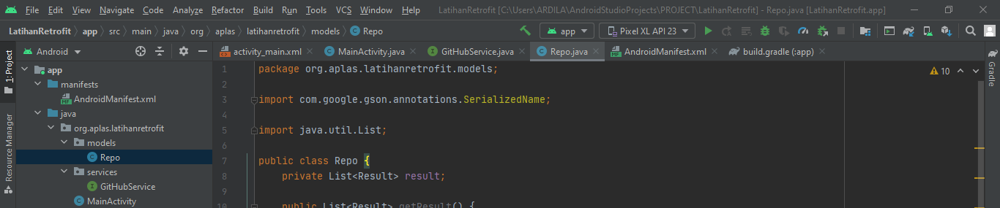

# Bab 10 Retrofit 

## Tujuan Pembelajaran

### 1.Mahasiswa mampu mengonfigurasi Retrofit pada android.
### 2.  Mahasiswa mampu membuat request ke RESTful API menggunakan Retrofit. 

## Langkah Praktikum

#

1. Silakan buat New Project di Android Studio dengan nama LatihanRetrofit. 
  

2. Tambahkan izin koneksi internet di AndroidManifest.xml. 
  

3. Tambahkan dependencies library Retrofit, converter-gson, dan compileOptions. 
  

4. Buatlah package bernama services lalu buat class interface didalamnya.  
  

5. Buatlah package bernama models lalu buat class POJO didalamnya.  
  

  

6. Pada class MainActivity, buat request ke REST API. 
  

  

7. Struktur packages dan class seharusnya seperti pada gambar berikut. 
  

