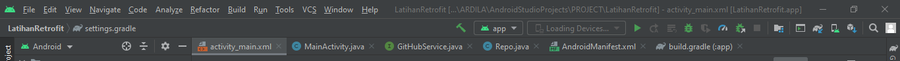
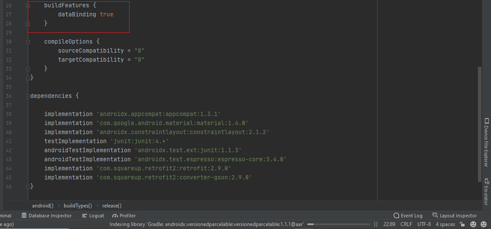
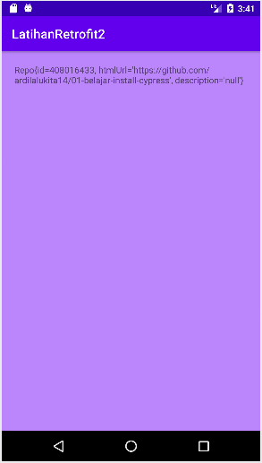

# Bab 09 Retrofit 

## Tujuan Pembelajaran

### 1.Mahasiswa mampu mengonfigurasi Retrofit pada android.
### 2.  Mahasiswa mampu membuat request ke RESTful API menggunakan Retrofit. 

## Langkah Praktikum

#

1. Silakan buat New Project di Android Studio dengan nama LatihanRetrofit. 
  

2. Tambahkan izin koneksi internet di AndroidManifest.xml. 
  

3. Tambahkan dependencies library Retrofit, converter-gson, dan compileOptions. 
  

4. Buatlah package bernama services lalu buat class interface didalamnya.  
  

5. Buatlah package bernama models lalu buat class POJO didalamnya.  
 

  

6. Pada class MainActivity, buat request ke REST API. 
 

  

7. Struktur packages dan class seharusnya seperti pada gambar berikut. 
  

8. Dikarenakan pada praktikum kali ini belum menggunakan DataBinding, maka kita coba gunakan Console Logging with Log.d and Logcat. Berikut untuk kode program yang harus ditambahkan di dalam file MainActivity. 
  

09. Kemudian kita coba tambahkan menu Logcat untuk memeriksa hasil running Log. 
  

09. Baru kemudian kita coba jalankan, maka hasilnya seperti berikut. 
  

11. Jika kita ingin menggunakan data binding, maka kita bisa menambahkan ke dalam build gradle code berikut. 
  

12. Kita tambahkan toString() ke dalam class Repo. 
  

13. Untuk MainActivity kita lakukan beberapa perubahan dari sebelumnya, berikut untuk tampilannya. 
  

14. Kemudian untuk activity_main kita tambahkan kode program berikut. 
  

15. Maka ketika di run, tampilan layar device akan seperti berikut. 
  

## -   [Link Kode Program Main](../../src/project/09_retrofit/app/src/main/java/org/aplas/latihanretrofit/MainActivity.java)
## -   [Link Kode Program Repo](../../src/project/09_retrofit/app/src/main/java/org/aplas/latihanretrofit/models/Repo.java)
## -   [Link Kode Program GitHubService](../../src/project/09_retrofit/app/src/main/java/org/aplas/latihanretrofit/services/GitHubService.java)
## -   [Link Kode Program Layout](../../src/project/09_retrofit/app/src/main/res/layout/activity_main.xml)
## -   [Link Kode Program String](../../src/project/09_retrofit/app/src/main/res/values/strings.xml)
## -   [Link Kode Program Color](../../src/project/09_retrofit/app/src/main/res/values/colors.xml)
## -   [Link Kode Build Gradle](../../src/project/09_retrofit/app/build.gradle)

