# TANTANGAN

## Tujuan Pembelajaran

### 1.Mahasiswa mampu mengonfigurasi Retrofit pada android.
### 2.  Mahasiswa mampu membuat request ke RESTful API menggunakan Retrofit. 
#

## Langkah Penyelesaian

#

1. Tambahkan inputan dari user agar dapat mengganti username secara dinamis! 
a. Pertama kita tambahkan beberapa kode berikut ke dalam MainActivity.  
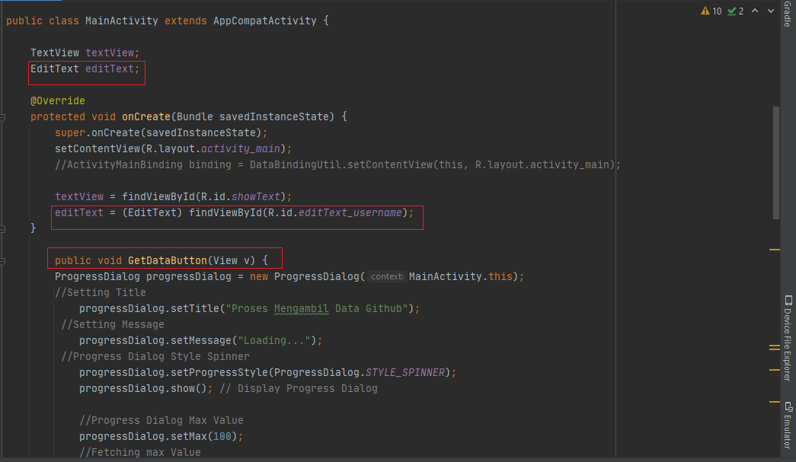 
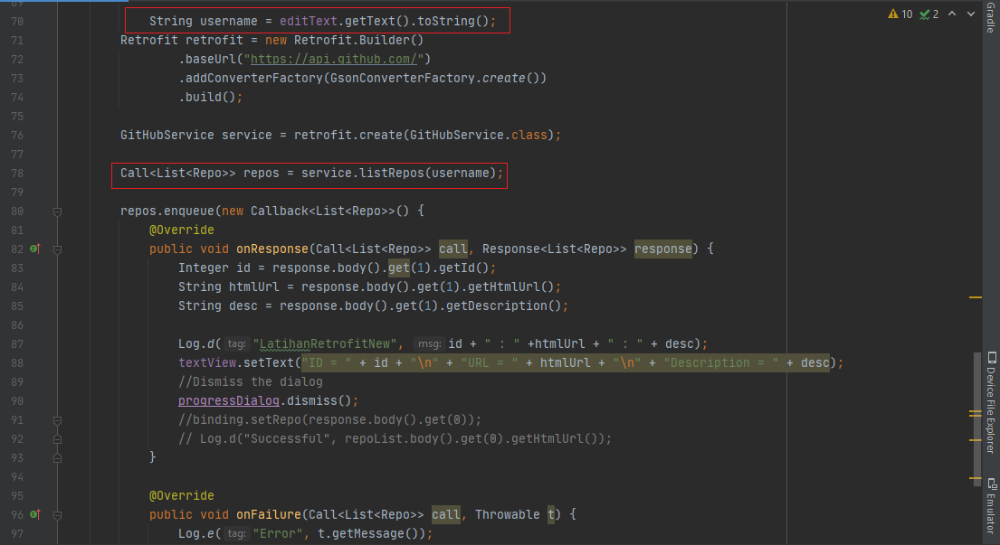  

   b. Kedua, kita tambahkan TextView, EditText, dan juga Button ke dalam activity_main, seperti berikut ini.  
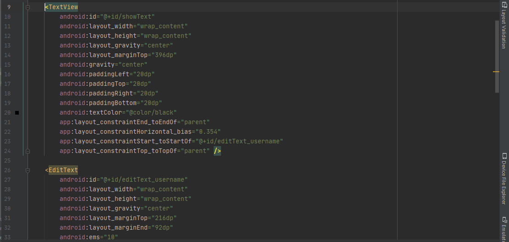 
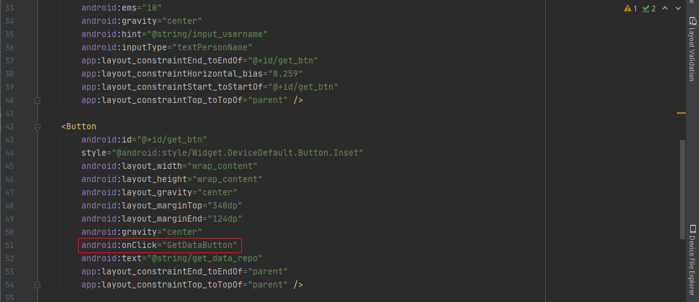 
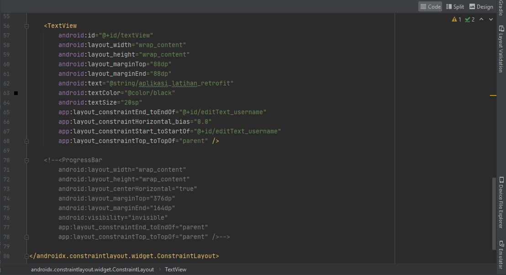 
   
    c. Maka, saat di run emulator / device akan menampilkan data github kita ketika kita berhasil memasukkan username github dan melakukan klik button. 
  
 

Kemudian, dikarenakan aplikasi yang kita buat ini sudah dinamis dalam hal pergantian username, maka saat kita mencoba mengganti username pada textbox, lalu mencoba klik button kembali. Maka, sistem / aplikasi akan berusaha memuat informasi kembali seputar ID, URL, dan Description dari username Github yang baru kita inputkan.  
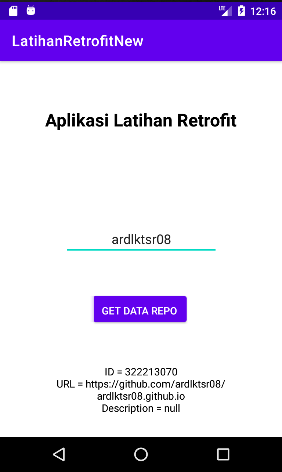 

2. Tambahkan tampilan loading atau progress bar ketika sedang proses request ke REST API! 
a. Untuk menyelesaikan tantangan ini, pertama kita coba tambahkan beberapa kode berikut ke dalam MainActivity.  
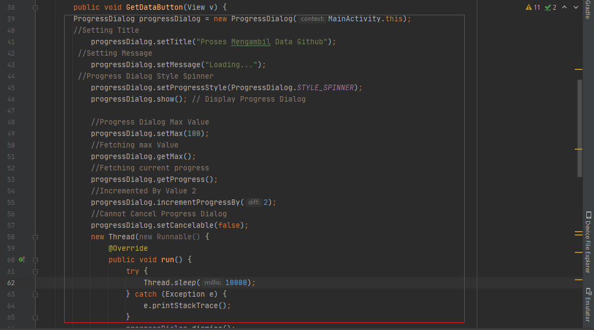 
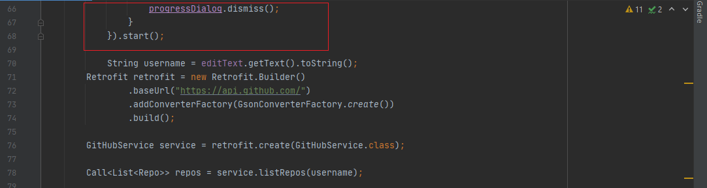 
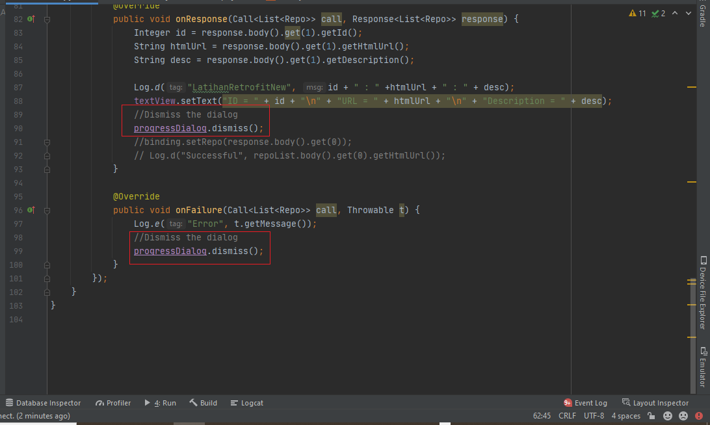 

   b. Kedua, untuk menerapkan tampilan loading atau progress bar di aplikasi kita saat sedang proses request ke REST API kita coba tambahkan juga kode berikut ke dalam layout activity_main tepatnya bagian button.  
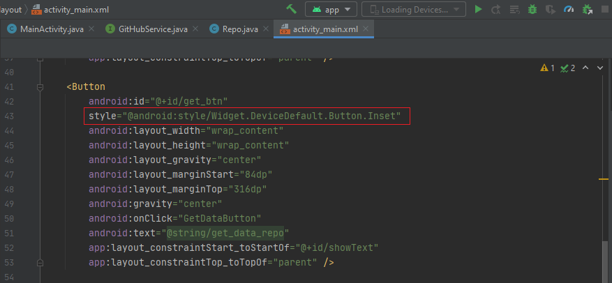 

    c. Sekarang kita coba running, maka saat kita klik button "GET DATA REPO" untuk mencari informasi terkait username yang telah kita inputkan di dalam textbox, secara otomatis sistem akan menampilkan loading atau progress bar sebelum menampilkan data / informasi yang diperoleh, ini menunjukkan adanya request ke REST API.  
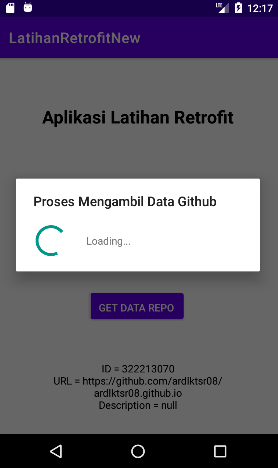  

3. Berikan  cara  memberitahukan  kepada  user  jika  gagal  request  ke  REST  API  selain menggunakan Toast! 
 
