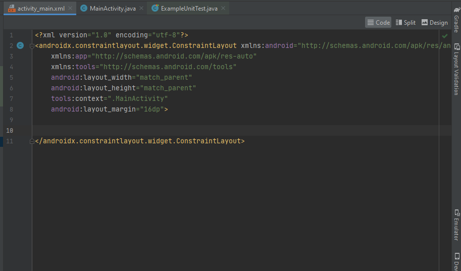
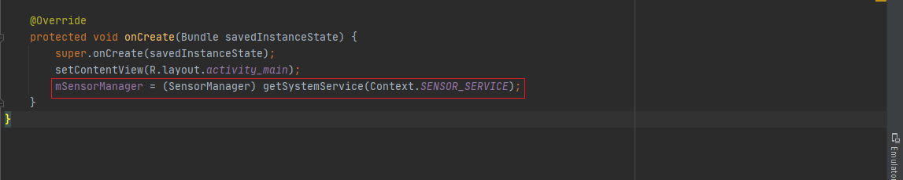

# Bab 12 Sensor dan Location

## Tujuan Pembelajaran

### 1.  Mahasiswa mengetahui cara membuat aplikasi terkait sensor-sensor.
### 2.  Mahasiswa mengetahui cara membuat aplikasi terkait location/map menggunakan GPS. 

## Langkah Praktikum

#

### 1. List the available sensors
#

1.1 Build the app

1. Create a new Android project. Call it SensorSurvey and use the Empty activity template. 
  

2. Open res/layout/activity_main.xml. 

3. Add a margin of 16 dp to the constraint layout. 
  

4. Delete the existing TextView.  
  

5. Add a ScrollView element inside the constraint layout. Give it these attributes:  
  

6. Add a TextView element inside the ScrollView and give it these attributes: 
  

7. This TextView holds the list of sensors. The placeholder text is replaced at runtime by the actual sensor list. The layout for your app should look like this screenshot: 
  

8. Open MainActivity and add a variable at the top of the class to hold an instance of SensorManager: 
 
The sensor manager is a system service that lets you access the device sensors. 

9. In the onCreate() method, below the setContentView() method, get an instance of the sensor manager from system services, and assign it to the mSensorManager variable: 
 

10. Get the list of all sensors from the sensor manager. Store the list in a List object whose values are of type Sensor: 
 
The Sensor class represents an individual sensor and defines constants for the available sensor types. The Sensor.TYPE_ALL constant indicates all the available sensors. 

11. Iterate over the list of sensors. For each sensor, get that sensor's official name with the getName() method, and append that name to the sensorText string. Each line of the sensor list is separated by the value of the line.separator property, typically a newline character: 
 

12. Get a reference to the TextView for the sensor list, and update the text of that view with the string containing the list of sensors: 
 

#

1.2 Run the app on a device and in the emulator
1. Run the app on a physical device. The output of the app looks something like this screenshot: 
 

2. Run the app in an emulator. The output of the app looks something like this screenshot: 
 
Because the Android emulator is a simulated device, all the available sensors are virtual sensors. "Goldfish" is the name of the emulator's Linux kernel. 

3. Click the More button (three horizontal dots) on the emulator's control panel. The Extended Controls window appears. 

4. Click Virtual Sensors. 
 
This window shows the settings and current values for the emulator's virtual sensors. Drag the image of the device to simulate motion and acceleration with the accelerometer. Dragging the device image may also rotate the main emulator window.

5. Click the Additional Sensors tab.  
 
This tab shows the other available virtual sensors for the emulator, including the light, temperature, and proximity sensors. You use more of these sensors in the next task. 

#

### Task 2. Get sensor data
#

The Android sensor framework provides the ability for your app to register for and react to changes in sensor data. In this task you modify your existing app to listen to and report values from the proximity and light sensors.

    The light sensor measures ambient light in lux, a standard unit of illumination. The light sensor typically is used to automatically adjust screen brightness.
    The proximity sensor measures when the device is close to another object. The proximity sensor is often used to turn off touch events on a phone's screen when you answer a phone call, so that touching your phone to your face does not accidentally launch apps or otherwise interfere with the device's operation.

#

2.1 Modify the layout

1. Open res/layout/activity_main.xml. 

2. Delete the ScrollView and TextView elements from the previous app. 
 

3. Add a TextView and give it the attributes in the following table. Extract the string into a resource called "label_light". This text view will print the current value from the light sensor. 
 

Bagian "%1$.2f" dari string teks adalah kode placeholder. Kode ini akan diganti dalam kode Java untuk aplikasi Anda dengan placeholder yang diisi dengan nilai numerik yang sebenarnya. Dalam hal ini kode placeholder memiliki tiga bagian:

    %1: Penampung pertama. Anda dapat menyertakan beberapa placeholder dalam string yang sama dengan %2, %3, dan seterusnya.
    $.2: Format angka. Dalam hal ini, .2 menunjukkan bahwa nilai harus diformat dengan hanya dua digit setelah titik desimal.
    f: Menunjukkan bahwa nilai yang akan ditampilkan adalah angka floating-point. Gunakan s untuk nilai string dan d untuk nilai desimal.

Bagian dari string yang tidak terdiri dari placeholder ("Sensor Cahaya: ") dilewatkan ke string baru. Anda dapat mengetahui lebih lanjut tentang placeholder dan kode pemformatan di dokumentasi Formatter.

4. Copy and paste the TextView element. Change the attributes in the following table. Extract the string into a resource called "label_proximity". This text view will print values from the proximity sensor. 
 

The layout for your app should look like this screenshot: 
  

5. Open res/values/strings.xml and add this line: 
  
You'll use this message in the next task when you test if a sensor is available. 

#

2.2 Get the sensors  
In this task, you modify the activity's onCreate() method to gain access to the light and proximity sensors. 

1. Open MainActivity and add private member variables at the top of the class to hold Sensor objects for the light and proximity sensors. Also add private member variables to hold the TextView objects from the layout: 
  

2. In the onCreate() method, delete all the existing code after the line to get the sensor manager.  

3. Add code to onCreate() to get the two TextView views and assign them to their respective variables: 
  

4. Get instances of the default light and proximity sensors. These will be instances of the Sensor class. Assign them to their respective variables: 
  
Metode getDefaultSensor() digunakan untuk query the sensor manager for sensors dari tipe tertentu. Jenis sensor ditentukan oleh kelas Sensor. Jika tidak ada sensor yang tersedia untuk tipe yang diberikan, metode getDefaultSensor() mengembalikan null.

5. Get the error string you defined earlier from the strings.xml resource: 
  

6. Test that there is an available light sensor. If the sensor is not available (that is, if getDefaultSensor() returned null), set the display text for the light sensor's TextView to the error string. 
  
Perangkat yang berbeda memiliki sensor yang berbeda, jadi penting bagi aplikasi Anda untuk memeriksa apakah ada sensor sebelum menggunakan sensor tersebut. Jika sensor tidak tersedia, aplikasi Anda harus menonaktifkan fitur yang menggunakan sensor tersebut dan memberikan informasi yang berguna kepada pengguna. Jika fungsionalitas aplikasi Anda bergantung pada sensor yang tidak tersedia, aplikasi Anda harus memberikan pesan dan berhenti dengan hati-hati. Jangan berasumsi bahwa perangkat apa pun akan memiliki sensor tertentu.

7. Test for the existence of the proximity sensor. 
  

#
2.3 Listen for new sensor data

1. At the top of the class, modify the class signature to implement the SensorEventListener interface. 
  

2. Click the red light bulb icon, select "implement methods," and select all methods.  
  

The SensorEventListener interface includes two callback methods that enable your app to handle sensor events:

    onSensorChanged(): Called when new sensor data is available. You will use this callback most often to handle new sensor data in your app.
    onAccuracyChanged(): Called if the sensor's accuracy changes, so your app can react to that change. Most sensors, including the light and proximity sensors, do not report accuracy changes. In this app, you leave onAccuracyChanged() empty.

3. Ganti metode siklus hidup aktivitas onStart() untuk mendaftarkan pendengar sensor Anda. Mendengarkan data sensor yang masuk menggunakan daya perangkat dan menghabiskan masa pakai baterai. Jangan daftarkan listener Anda di onCreate(), karena itu akan menyebabkan sensor menyala dan mengirim data (menggunakan daya perangkat) bahkan saat aplikasi Anda tidak berada di latar depan. Gunakan metode onStart() dan onStop() untuk mendaftarkan dan membatalkan pendaftaran pendengar sensor Anda. 
  
<b>Note:</b> The onStart() and onStop() methods are preferred over onResume() and onPause() to register and unregister listeners. As of Android 7.0 (API 24), apps can run in multi-window mode (split-screen or picture-in-picture mode). Apps running in this mode are paused, but still visible on screen. Use onStart() and onStop() to ensure that sensors continue running even if the app is in multi-window mode. 

4. Implement the onStop() lifecycle method to unregister your sensor listeners when the app pauses: 
  

5. In the onSensorChanged() method, get the sensor type. 
  

6. Also in onSensorChanged(), get the sensor value. 
  

7. Add a switch statement for the sensorType variable. Add a case for Sensor.TYPE_LIGHT to indicate that the event was triggered by the light sensor. 
  

8. Inside the light sensor case, get the template string from the resources, and update the value in the light sensor's TextView. 
  

9. Add a second case for the proximity sensor (Sensor.TYPE_PROXIMITY). 
  

#

2.4 Run the app on a device and in the emulator

1. Run the app on a physical device. The output of the app looks something like this screenshot: 
  

2. Move the device towards a light source, or shine a flashlight on it. Move the device away from the light or cover the device with your hand. Note how the light sensor reports changes in the light level.

TIP: The light sensor is often placed on the top right of the device's screen.

The light sensor's value is generally measured in lux, a standard unit of illumination. However, the lux value that a sensor reports may differ across different devices, and the maximum may vary as well. If your app requires a specific range of values for the light sensor, you must translate the raw sensor data into something your app can use. 
  

        Dikarenakan device / hp dilindungi / dijauhkan dari pusat cahaya, maka hasil light sensor semakin kecil.

3. Move your hand toward the device, and then move it away again. Note how the proximity sensor reports values indicating "near" and "far." Depending on how the proximity sensor is implemented, you may get a range of values, or you may get just two values (for example, 0 and 5) to represent near and far.

TIP: The proximity sensor is often a virtual sensor that gets its data from the light sensor. For that reason, covering the light sensor may produce changes to the proximity value.

As with the light sensor, the sensor data for the proximity sensor can vary from device to device. Proximity values may be a range between a minimum and a maximum. More often there are only two proximity values, one to indicate "near," and one to indicate "far." All these values may vary across devices. 
  

        Nilai proximity sensor tidak memeberikan perubahan saat dicoba di device (kurang responsif), sehingga hasil yang diberikan saat tangan didekatkan ataupun dijauhkan dari device tetap sama yaitu bernilai 5.00

4. Run the app in an emulator, and click the More button (three horizontal dots) on the emulator's control panel to bring up the Extended controls window. 

5. Click Virtual sensors, and then click the Additional sensors tab.

        The sliders in this window enable you to simulate changes to sensor data that would normally come from the hardware sensors. Changes in this window generate sensor events in the emulator that your app can respond to. 

6. Move the sliders for the light and proximity sensors and observe that the values in the app change as well. 

<b> Masih di titik 0. 
  

<b> Sesudah di rubah nilainya. 
  

        Semakin di geser ke kanan, nilai light sensor dan proximity sensor semakin bertambah.

#

3.2: Working with sensor-based orientation

#

Task 1. Build the TiltSpot app

1.1 Download and explore the starter app

1. Download the TiltSpot_start app and open it in Android Studio.
2. Open res/layout/activity_main.xml.
3. Open MainActivity. 

MainActivity in this starter app contains much of the skeleton code for managing sensors and sensor data as you learned about in the last practical.

1. Examine the onCreate() method. 
2. At the top of onCreate(), note this line: 
  

        Baris ini mengunci aktivitas dalam mode potret, untuk mencegah aplikasi memutar aktivitas secara otomatis saat Anda memiringkan perangkat. Rotasi aktivitas dan data sensor dapat berinteraksi dengan cara yang tidak terduga. Kemudian dalam praktiknya, Anda secara eksplisit menangani perubahan data sensor di aplikasi Anda sebagai respons terhadap rotasi aktivitas, dan menghapus baris ini.

3. Examine the onStart() and onStop() methods. The onStart() method registers the listeners for the accelerometer and magnetometer, and the onStop() method unregisters them. 
  
  

4. Examine onSensorChanged() and onAccuracyChanged(). These are the methods from the SensorEventListener interface that you have to implement. The onAccuracyChanged() method is empty because it is unused in this class. You implement onSensorChanged() in the next task. 
  

#
1.2 Get sensor data and calculate orientation angles

1. Open MainActivity. 
2. Add member variables to hold copies of the accelerometer and magnetometer data. 
  

        Ketika peristiwa sensor terjadi, baik akselerometer dan magnetometer menghasilkan larik nilai titik-mengambang yang mewakili titik-titik pada sumbu-x, sumbu-y, dan sumbu-z dari sistem koordinat perangkat. Anda akan menggabungkan data dari kedua sensor ini, dan melalui beberapa panggilan ke onSensorChanged(), jadi Anda perlu menyimpan salinan data ini setiap kali berubah.

3. Scroll down to the onSensorChanged() method. Add a line to get the sensor type from the sensor event object: 
  

4. Add tests for the accelerometer and magnetometer sensor types, and clone the event data into the appropriate member variables: 
 

        Anda menggunakan metode clone() untuk secara eksplisit membuat salinan data dalam larik nilai. Objek SensorEvent (dan larik nilai yang dikandungnya) digunakan kembali di seluruh panggilan ke onSensorChanged(). Mengkloning nilai tersebut mencegah data yang saat ini Anda butuhkan diubah oleh data yang lebih baru sebelum Anda selesai menggunakannya.

5. After the switch statement, use the SensorManager.getRotationMatrix() method to generate a rotation matrix (explained below) from the raw accelerometer and magnetometer data. The matrix is used in the next step to get the device orientation, which is what you're really interested in. 
 

6. Call the SensorManager.getOrientation() method to get the orientation angles from the rotation matrix. As with getRotationMatrix(), the array of float values containing those angles is supplied to the getOrientation() method and modified in place. 
 

7. Create variables for azimuth, pitch, and roll, to contain each component of the orientationValues array. You adjust this data later in the practical, which is why it is helpful to have these separate variables. 
 

8. Get the placeholder strings, from the resources, fill the placeholder strings with the orientation angles and update all the text views. 
 

9. The string (value_format in strings.xml) contains placeholder code ("%1$.2f") that formats the incoming floating-point value to two decimal places. 
 

#

1.3 Build and run the app

1. Run the app. Place your device flat on the table. The output of the app looks something like this: 
 

Bahkan perangkat yang tidak bergerak menunjukkan nilai yang berfluktuasi untuk azimuth, pitch, dan roll. Perhatikan juga bahwa meskipun perangkat datar, nilai pitch and roll mungkin tidak 0. Ini karena sensor perangkat sangat sensitif dan menangkap bahkan perubahan kecil pada lingkungan, baik perubahan gerakan maupun perubahan medan magnet sekitar.

2. Turn the device on the table from left to right, leaving it flat on the table. 
  

        Note how the value of the azimuth changes. An azimuth value of 0 indicates that the device is pointing (roughly) north.

        Note that even if the value of the azimuth is 0, the device may not be pointing exactly north. The device magnetometer measures the strength of any magnetic fields, not just that of the Earth. If you are in the presence of other magnetic fields (most electronics emit magnetic fields, including the device itself), the accuracy of the magnetometer may not be exact. 

        <b>Note</b>: If the azimuth on your device seems very far off from actual north, you can calibrate the magnetometer by waving the device a few times in the air in a figure-eight motion. 

3. Lift the bottom edge of the device so the screen is tilted away from you. Note the change to the pitch value. Pitch indicates the top-to-bottom angle of tilt around the device's horizontal axis. 
 

4. Lift the left side of the device so that it is tilted to the right. Note the change to the roll value. Roll indicates the left-to-right tilt along the device's vertical axis. Changes to roll. 
 

5. Pick up the device and tilt it in various directions. Note the changes to the pitch and roll values as the device's tilt changes. What is the maximum value you can find for any tilt direction, and in what device position does that maximum occur? 

     - Timur  
 
     - Tenggara   
 
     - Selatan  
 
     - Barat Daya  
 
     - Barat  
 
     - Barat Laut  
 
     - Utara  
 
     - Timur Laut  
 

<b>Noted : </b> Yang paling besar untuk angka pitch dan roll-nya ialah ketika device / hp diarahkan ke arah timur yang mana nilai pitch-nya sebesar <b>0.07</b> dan untuk roll-nya sebesar <b>1.21</b>.

#

Task 2. Add the spots

#

2.1 Add the spots and modify the layout

1. Add a new file called spot.xml to the project, in the res/drawable directory. (Create the directory if needed.) 
 

2. Replace the selector tag in spot.xml with an oval shape drawable whose color is solid black ("@android:color/black"): 
 

3. Open res/values/dimens.xml. Add a dimension for the spot size: 
 

4. In activity_layout.xml, add an ImageView after the inner ConstraintLayout, and before the outer one. Use these attributes: 
 

        This view places a spot drawable the size of the spot_size dimension at the top edge of the screen. Use the app:srcCompat attribute for a vector drawable in an ImageView (versus android:src for an actual image.) The app:srcCompat attribute is available in the Android Support Library and provides the greatest compatibility for vector drawables.

        The tools:ignore attribute is used to suppress warnings in Android Studio about a missing content description. Generally ImageView views need alternate text for sight-impaired users, but this app does not use or require them, so you can suppress the warning here. 

5. Add the following code below that first ImageView. This code adds the other three spots along the remaining edges of the screen. 

 
 

6. The layout preview should now look like this: 

7. Add the android:alpha attribute to all four ImageView elements, and set the value to "0.05". The alpha is the opacity of the shape. Smaller values are less opaque (less visible). Setting the value to 0.05 makes the shape very nearly invisible, but you can still see them in the layout view. 

 

#

2.2 Update the spot color with new sensor data

Next you modify the onSensorChanged() method to set the alpha value of the spots in response to the pitch and roll values from the sensor data. A higher sensor value indicates a larger degree of tilt. The higher the sensor value, the more opaque (the darker) you make the spot.

1. In MainActivity, add member variables at the top of the class for each of the spot ImageView objects: 

 

2. In onCreate(), just after initializing the text views for the sensor data, initialize the spot views: 

 

3. In onSensorChanged(), right after the lines that initialize the azimuth, pitch, and roll variables, reset the pitch or roll values that are close to 0 (less than the value of the VALUE_DRIFT constant) to be 0: 

 

        Saat Anda pertama kali menjalankan aplikasi TiltSpot, sensor melaporkan nilai bukan nol yang sangat kecil untuk pitch and roll bahkan saat perangkat datar dan tidak bergerak. Nilai-nilai kecil itu dapat menyebabkan aplikasi mem-flash bintik-bintik berwarna sangat terang di semua tepi layar. Dalam kode ini jika nilainya mendekati 0 (baik dalam arah positif atau negatif), Anda meresetnya ke 0.

4. Scroll down to the end of onSensorChanged(), and add these lines to set the alpha of all the spots to 0. This resets all the spots to be invisible each time onSensorChanged() is called. This is necessary because sometimes if you tilt the device too quickly, the old values for the spots stick around and retain their darker color. Resetting them each time prevents these artifacts. 

 

5. Update the alpha value for the appropriate spot with the values for pitch and roll. 

 

        Perhatikan bahwa nilai pitch dan roll yang Anda hitung pada tugas sebelumnya adalah dalam radian, dan nilainya berkisar dari -π hingga +π. Nilai alfa, di sisi lain, hanya berkisar dari 0,0 hingga 1,0. Anda dapat melakukan matematika untuk mengonversi satuan radian ke nilai alfa, tetapi Anda mungkin telah mencatat sebelumnya bahwa nilai pitch dan roll yang lebih tinggi hanya terjadi ketika perangkat dimiringkan vertikal atau bahkan terbalik. Untuk aplikasi TiltSpot, Anda hanya tertarik untuk menampilkan titik sebagai respons terhadap beberapa kemiringan perangkat, bukan rentang penuh. Ini berarti Anda dapat dengan mudah menggunakan satuan radian secara langsung sebagai input ke alfa.

6. Build and run the app. 

    You should now be able to tilt the device and have the edge facing "up" display a dot which becomes darker the further up you tilt the device.  
 

 

#
Task 3. Handle activity rotation
#

3.1 Get the device rotation and remap the coordinate system

1. In MainActivity, edit onCreate() to remove or comment out the call to setRequestedOrientation(). 
 

2. In MainActivity, add a member variable for the Display object. 
 

3. At the end of onCreate(), get a reference to the window manager, and then get the default display. You use the display to get the rotation in onSensorChanged(). 
 

4. In onSensorChanged(), just after the call to getRotationMatrix(), add a new array of float values to hold the new adjusted rotation matrix. 
 

5. Get the current device rotation from the display and add a switch statement for that value. Use the rotation constants from the Surface class for each case in the switch. For ROTATION_0, the default orientation, you don't need to remap the coordinates. You can just clone the data in the existing rotation matrix: 
 

6. Add additional cases for the other rotations, and call the SensorManager.remapCoordinateSystem() method for each of these cases.  
 

        Metode ini menggunakan matriks rotasi asli sebagai argumen, dua sumbu baru tempat Anda ingin memetakan kembali sumbu x dan sumbu y yang ada, dan larik untuk diisi dengan data baru. Gunakan konstanta sumbu dari kelas SensorManager untuk mewakili sumbu sistem koordinat.

7. Modify the call to getOrientation() to use the new adjusted rotation matrix instead of the original matrix. 
 

8. Build and run the app again. The colors of the spots should now change on the correct edges of the device, regardless of how the device is rotated.  
 
 
