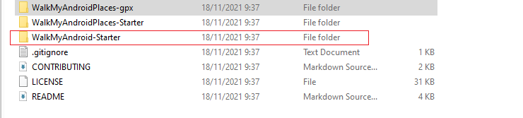
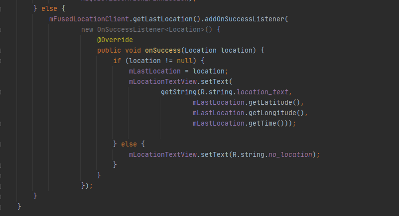
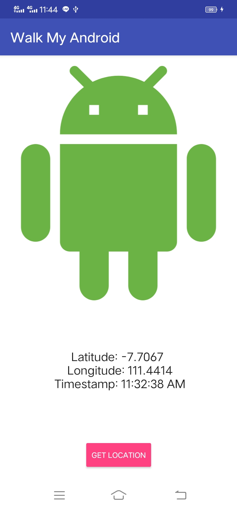
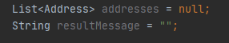
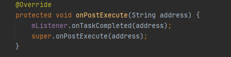
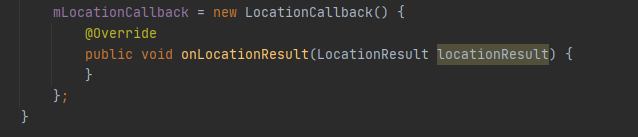
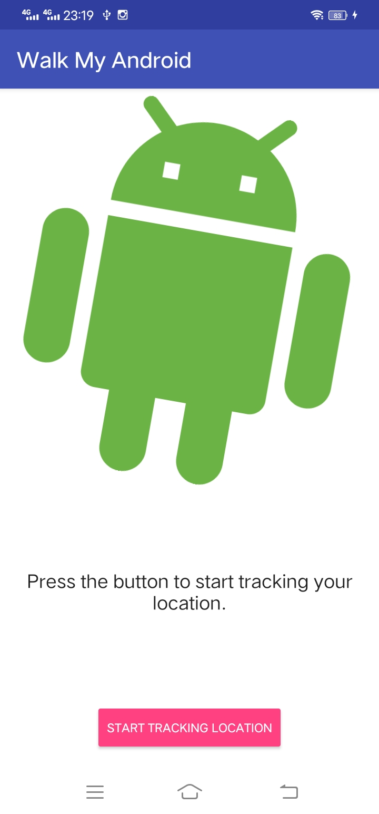
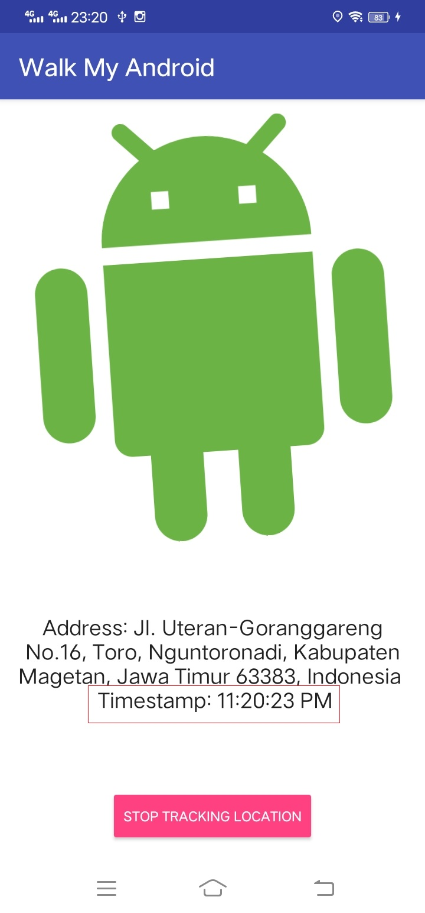
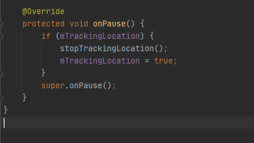
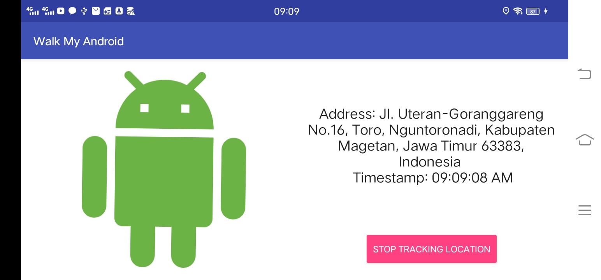

# Bab 12 Sensor dan Location

## Tujuan Pembelajaran

### 1.  Mahasiswa mengetahui cara membuat aplikasi terkait sensor-sensor.
### 2.  Mahasiswa mengetahui cara membuat aplikasi terkait location/map menggunakan GPS. 

## Langkah Praktikum

#

### 7.1: Using the device location
#

### Task 1. Set up location services

1.1 Download the starter app
1. Download the starter app for this practical, WalkMyAndroid-Starter. 
  
2. Open the starter app in Android Studio, rename the app to WalkMyAndroid, and run it. 
  
3. You might need to update your Android SDK Build-Tools. To do this, use the Android SDK Manager.

#

1.2 Set up Google Play services

Install the Google Repository and update the Android SDK Manager:
1. Open Android Studio.
2. Select Tools > Android > SDK Manager.
3. Select the SDK Tools tab.
4. Expand Support Repository, select Google Repository, and click OK. 
Now you can include Google Play services packages in your app.

To add Google Play services to your project, add the following line of code to the dependencies section in your app-level build.gradle (Module: app) file: 
  

#
Task 2. Get the last known location
#

2.1 Set location permission in the manifest

1. Add the following element to your manifest file, above the <application> element: 
  

#
2.2 Request permission at runtime

Dimulai dengan Android 6.0 (API level 23), tidak selalu cukup untuk menyertakan pernyataan izin dalam manifes. Untuk izin "berbahaya", Anda juga harus meminta izin secara terprogram, saat runtime.

To request location permission at runtime:

1. Create an OnClickListener for the Get Location button in onCreate() in MainActivity. 
  

2. Create a method stub called getLocation() that takes no arguments and doesn't return anything. Invoke the getLocation() method from the button's onClick() method. 
  

3. In the getLocation() method, check for the ACCESS_FINE_LOCATION permission.

    If the permission has not been granted, request it.
    If the permission has been granted, display a message in the logs. (The code below shows a TAG variable, which you declare later, in Task 3.1.)

    For information on runtime permissions, see Requesting Permissions at Run Time. 
  

4. In your MainActivity class, define an integer constant REQUEST_LOCATION_PERMISSION. This constant is used to identify the permission request when the results come back in the onRequestPemissionsResult() method. It can be any integer greater than 0. 
  

5. Override the onRequestPermissionsResult() method. If the permission was granted, call getLocation(). Otherwise, show a Toast saying that the permission was denied. 
  

6. Run the app. Clicking the button requests permission from the user. If permission is granted, you see a log statement in the console. 

After you grant permission, subsequent clicks on the Get Location button have no effect. Because you already granted permission, the app doesn't need to ask for permission again (unless the user manually revokes it in the Settings app), even if you close and restart the app.
 

#
2.3 Get the last known location

To get the last known location:

1. In strings.xml, add a string resource called location_text. Use location_text to display the latitude, longitude, and timestamp of the last known location. 
  

    <b>Note</b>: If you aren't familiar with string replacement and formatting, see Formatting and Styling and the Formatter documentation. 

2. In your MainActivity class, create a member variable of the Location type called mLastLocation. 
  

3. Find the location TextView by ID (textview_location) in onCreate(). Assign the TextView to a member variable called mLocationTextView. 
  

4. Create a member variable of the FusedLocationProviderClient type called mFusedLocationClient. 
  

5. Initialize mFusedLocationClient in onCreate() with the following code: 
  

        Metode getLastLocation() mengembalikan Tugas yang menghasilkan objek Lokasi (setelah metode callback onSuccess() Tugas dipanggil, menandakan bahwa Tugas berhasil).

        Ambil koordinat lintang dan bujur lokasi geografis dari objek Lokasi yang dihasilkan:

6. Replace the log statement in the getLocation() method with the following code snippet. The code obtains the device's most recent location and assigns it to mLastLocation. 
  

        Jika lokasi yang dikembalikan bukan nol, atur TextView untuk menampilkan koordinat dan stempel waktu objek Lokasi.Jika lokasi yang dikembalikan adalah nol, penyedia lokasi yang digabungkan belum memperoleh lokasi sejak perangkat dimulai ulang. Tampilkan pesan di TextView yang mengatakan bahwa lokasi tidak tersedia.

7. Run the app. You now see the latest location that is stored in the fused location provider. 
  

#

Testing location on an emulator

#

If you test the WalkMyAndroid app on an emulator, use a system image that supports Google APIs or Google Play:

    1. In Android Studio, create a new virtual device and select hardware for it.
    2. In the System Image dialog, choose an image that says "Google APIs" or "Google Play" in the Target column.  
  

To update the fused location provider on an emulator:

1. The emulator appears on your screen with a vertical menu to the right of the virtual device. To access emulator options, click the ... icon at the bottom of this vertical menu.
2. Click Location.
3. Enter or change the coordinates in the Longitude and Latitude fields.
4. Click Send to update the fused location provider. 

        Mengklik Kirim tidak memengaruhi lokasi yang dikembalikan oleh getLastLocation(), karena getLastLocation() menggunakan cache lokal yang tidak diperbarui oleh alat emulator.

        Saat Anda menguji aplikasi pada emulator, metode getLastLocation() mungkin mengembalikan null, karena penyedia lokasi yang digabungkan tidak memperbarui cache lokasi setelah perangkat dimulai ulang. Jika getLastLocation() mengembalikan null secara tidak terduga:

        Mulai aplikasi Google Maps dan setujui persyaratan dan ketentuan, jika Anda belum melakukannya.
        Gunakan langkah-langkah di atas untuk memperbarui penyedia lokasi yang menyatu. Google Maps akan memaksa cache lokal untuk diperbarui.
        Kembali ke aplikasi Anda dan klik tombol Dapatkan Lokasi. Pembaruan aplikasi dengan lokasi baru.

Nanti dalam pelajaran ini, Anda akan mempelajari cara memaksa lokasi yang digabungkan untuk memperbarui cache menggunakan pembaruan berkala.

#

Task 3. Get the location as an address

#

3.1 Create an AsyncTask subclass

1. Create a new class called FetchAddressTask that is a subclass of AsyncTask. Parameterize the AsyncTask using the three types described above: 
  
  

2. In Android Studio, this class declaration is underlined in red, because you have not implemented the required doInBackground() method. Press Alt + Enter (Option + Enter on a Mac) on the highlighted line and select Implement methods. (Or select Code > Implement methods.)

        Notice that the method signature for doInBackground() includes a parameter of the Location type, and returns a String; this comes from parameterized types in the class declaration.

     
      

3. Override the onPostExecute() method by going to the menu and selecting Code > Override Methods and selecting onPostExecute(). Again notice that the passed-in parameter is automatically typed as a String, because this what you put in the FetchAddressTask class declaration. 
     
     
      

4. Create a constructor for the AsyncTask that takes a Context as a parameter and assigns it to a member variable.

    Your FetchAddressTask now looks something like this:

     
      

#

3.2 Convert the location into an address string

In this step, you complete the doInBackground() method so that it converts the passed-in Location object into an address string, if possible. If there is a problem, you show an error message.

1. Create a Geocoder object. This class handles both geocoding (converting from an address into coordinates) and reverse geocoding: 
      

2. Obtain a Location object. The passed-in parameter is a Java varargs argument that can contain any number of objects. In this case we only pass in one Location object, so the desired object is the first item in the varargs array: 
      

3. Create an empty List of Address objects, which will be filled with the address obtained from the Geocoder. Create an empty String to hold the final result, which will be either the address or an error: 
      

4. You are now ready to start the geocoding process. Open up a try block and use the following code to attempt to obtain a list of addresses from the Location object. The third parameter specifies the maximum number of addresses that you want to read. In this case you only want a single address:: 
      

5. Open a catch block to catch IOException exceptions that are thrown if there is a network error or a problem with the Geocoder service. In this catch block, set the resultMessage to an error message that says "Service not available." Log the error and result message: 
      

6. Open another catch block to catch IllegalArgumentException exceptions. Set the resultMessage to a string that says "Invalid coordinates were supplied to the Geocoder," and log the error and result message: 
      

7. You need to catch the case where Geocoder is not able to find the address for the given coordinates. In the try block, check the address list and the resultMessage string. If the address list is empty or null and the resultMessage string is empty, then set the resultMessage to "No address found" and log the error: 
      

8. If the address list is not empty or null, the reverse geocode was successful. 
        Langkah selanjutnya adalah membaca alamat pertama menjadi string, baris demi baris:

        Buat ArrayList dari Strings yang kosong.
        Ulangi objek Daftar Alamat dan baca ke dalam ArrayList baru baris demi baris.
        Gunakan metode TextUtils.join() untuk mengonversi daftar menjadi string. Gunakan karakter \n untuk memisahkan setiap baris dengan karakter baris baru:
        Berikut kodenya:
    
     
      

9. At the bottom of doInBackground() method, return the resultMessage object.  
      

#

3.3 Display the result of the FetchAddressTask object

#

1. Create a new string resource with two replacement variables. 
      

2. Create an interface in FetchAddressTask called OnTaskCompleted that has one method, called onTaskCompleted(). This method should take a string as an argument: 
      

3. Add a parameter for the OnTaskCompleted interface to the FetchAddressTask constructor, and assign it to a member variable: 
      

4. In the onPostExecute() method, call onTaskCompleted() on the mListener interface, passing in the result string: 
      

5. Back in the MainActivity, update the activity to implement the FetchAddressTask.OnTaskCompleted interface you created and override the required onTaskCompleted() method. 
      

6. In this method, updated the TextView with the resulting address and the current time: 
      

7. In the getLocation() method, inside the onSuccess() callback, replace the lines that assigns the passed-in location to mLastLocation and sets the TextView with the following line of code. This code creates a new FetchAddressTask and executes it, passing in the Location object. You can also remove the now unused mLastLocation member variable. 
      

8. At the end of the getLocation() method, show loading text while the FetchAddressTask runs: 
      
9. Run the app. After briefly loading, the app displays the location address in the TextView. 
      

#
Task 4. Receive location updates
#

4.1 Set up the UI and method stubs

1. In MainActivity, declare the member variables mAndroidImageView (of type ImageView) and mRotateAnim (of type AnimatorSet). 
      

2. In the onCreate() method, find the Android ImageView by ID and assign it to mAndroidImageView. Then find the animation included in the starter code by ID and assign it to mRotateAnim. Finally set the Android ImageView as the target for the animation: 
      
 
3. In the strings.xml file:

     - Change the button text to "Start Tracking Location." Do this for for both the portrait and the landscape layouts.
     - Change the TextView text to "Press the button to start tracking your location."
      
      

4. Refactor and rename the getLocation() method to startTrackingLocation(). 
      

5. Create a private method stub called stopTrackingLocation() that takes no arguments and returns void. 
      

6. Create a boolean member variable called mTrackingLocation. Boolean primitives default to false, so you do not need to initialize mTrackingLocation. 
      

7. Change the onClick() method for the button's onClickListener:

    - If mTrackingLocation is false, call startTrackingLocation().
    - If mTrackingLocation is true, call stopTrackingLocation(). 
      

8. At the end of the startTrackingLocation() method, start the animation by calling mRotateAnim.start(). Set mTrackingLocation to to true and change the button text to "Stop Tracking Location". 
     
     

9. In the stopTrackingLocation() method, check if the you are tracking the location. If you are, stop the animation by calling mRotateAnim.end(), set mTrackingLocation to to false, change the button text back to "Start Tracking Location" and reset the location TextView to show the original hint. 
     

#
4.2 Create the LocationRequest object
#

To create the LocationRequest object:
1. Create a method called getLocationRequest() that takes no arguments and returns a LocationRequest. 
     

2. Set the interval, fastest interval, and priority parameters. 
     

#

4.3 Create the LocationCallback object
When your app requests a location update, the fused location provider invokes the LocationCallback.onLocationResult() callback method. The incoming argument contains a list of Location objects containing the location's latitude and longitude. 

To create a LocationCallback object:

1. At the bottom of onCreate(), create a new LocationCallback object and assign it to a member variable called mLocationCallback. 
     

2. Override the onLocationResult() method. 
     

#

4.4 Request location updates

You now have the required LocationRequest and LocationCallback objects to request periodic location updates. When your app receives the LocationResultobjects in onLocationResult(), use the FetchAddressTask to reverse geocode the Location object into an address: 

#

1. To request periodic location updates, replace the call to getLastLocation() in startTrackingLocation() (along with the OnSuccessListener) with the following method call. Pass in the LocationRequest and LocationCallback: 
     

2. In the stopTrackingLocation() method, call removeLocationUpdates() on mFusedLocationClient. Pass in the LocationCallback object. 
     

3. In the onLocationResult() callback, check mTrackingLocation. If mTrackingLocation is true, execute FetchAddressTask(), and use the LocationResult.getLastLocation() method to obtain the most recent Location object. 
     

4. In onTaskComplete(), where the UI is updated, wrap the code in an if statement that checks the mTrackingLocation boolean. If the user turns off the location updates while the AsyncTask is running, the results are not displayed to the TextView. 
     

5. Run the app. Your app tracks your location, updating the location approximately every ten seconds. 
     

    <b>Note</b> : Lokasi diperbarui 10 detik sekali, seperti yang telah diatur di dalam program. 
     
     

    Testing the location-update functionality on an emulator can be tough: the UI will say "Loading" until you send a new location, and seeing the timing of the set interval is impossible. You can use a GPX file to simulate different locations over time. For testing, you can use the places_gps_data.gpx GPX file, which contains several locations:

    
    1. Download the places_gps_data.gpx file.
    2. Open your emulator, click the ... icon at the bottom of this vertical settings menu, and select the Location tab.
    3. Click Load GPX/KML and select the downloaded file.
     
     
    4. Change the duration of each item to 10 seconds, and click the play button. If you start tracking when the GPX file is playing, you see a changing address displayed in the UI.
     
     

    <b>Hasil :</b>
     
     
     
     

    Right now, the app continues to request location updates until the user clicks the button, or until the Activity is destroyed. To conserve power, stop location updates when your Activity is not in focus (in the paused state) and resume location updates when the Activity regains focus:

    
    1. Override the Activity object's onResume() and onPause() methods. 
     
    2. In onResume(), check mTrackingLocation. If mTrackingLocation is true, call startTrackingLocation(). 
     
    3. In onPause(), check mTrackingLocation. If mTrackingLocation is true, call stopTrackingLocation() but set mTrackingLocation to true so the app continues tracking the location when it resumes. 
     
    4. Run the app and turn on location tracking. Exiting the app stops the location updates when the activity is not visible. 
     

    <Hasil :>
    Saat pertama kali di start : 
     
    Ketika mencoba keluar dari aplikasi saat masih running, maka aplikasi secara otomatis akan meng-close semua aktivitasnya dan kembali ke kondisi seperti semula sebelum dilakukan start tracking location. 
     

#

4.5 Make the tracking state persistent

If you run the app and rotate the device, the app resets to its initial state. The mTrackingLocation boolean is not persistent across configuration changes, and it defaults to false when the Activity is recreated. This means the UI defaults to the initial state.

In this step, you use the saved instance state to make mTrackingLocation persistent so that the app continues to track location when there is a configuration change.
#

1. Override the Activity object's onSaveInstanceState() method. 
     

2. Create a string constant called TRACKING_LOCATION_KEY. You use this constant as a key for the mTrackingLocation boolean. 
     

3. In onSaveInstanceState(), save the state of the mTrackingLocation boolean by using the putBoolean() method: 
     

4. In onCreate(), restore the mTrackingLocation variable before you create the LocationCallback instance (because the code checks for the mTrackingLocation boolean before starting the FetchAddressTask): 
     

5. Run the app and start location tracking. Rotate the device. A new FetchAddressTask is triggered, and the device continues to track the location.

<b>Hasil:</b> 

   - Sebelum device di rotasi / putar.    

   - Sesudah device di rotasi / putar.   

   
## -   [Link Kode Program Java](../../src/project/08_sensorListener/app/src/main/java/org/aplas/sensorlistener/MainActivity.java)
## -   [Link Kode Program Layout](../../src/project/08_sensorListener/app/src/main/res/layout/activity_main.xml)
## -   [Link Kode Program String](../../src/project/08_sensorListener/app/src/main/res/values/strings.xml)
## -   [Link Kode Program Color](../../src/project/08_sensorListener/app/src/main/res/values/colors.xml)
## -   [Link Kode Build Gradle](../../src/project/08_sensorListener/app/build.gradle)

