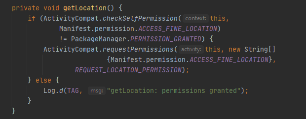

# Bab 12 Sensor dan Location

## Tujuan Pembelajaran

### 1.  Mahasiswa mengetahui cara membuat aplikasi terkait sensor-sensor.
### 2.  Mahasiswa mengetahui cara membuat aplikasi terkait location/map menggunakan GPS. 

## Langkah Praktikum

#

### 7.1: Using the device location
#

### Task 1. Set up location services

1.1 Download the starter app
1. Download the starter app for this practical, WalkMyAndroid-Starter. 
  
2. Open the starter app in Android Studio, rename the app to WalkMyAndroid, and run it. 
  
3. You might need to update your Android SDK Build-Tools. To do this, use the Android SDK Manager.

#

1.2 Set up Google Play services

Install the Google Repository and update the Android SDK Manager:
1. Open Android Studio.
2. Select Tools > Android > SDK Manager.
3. Select the SDK Tools tab.
4. Expand Support Repository, select Google Repository, and click OK. 
Now you can include Google Play services packages in your app.

To add Google Play services to your project, add the following line of code to the dependencies section in your app-level build.gradle (Module: app) file: 
  

#
Task 2. Get the last known location
#

2.1 Set location permission in the manifest

1. Add the following element to your manifest file, above the <application> element: 
  

#
2.2 Request permission at runtime

Dimulai dengan Android 6.0 (API level 23), tidak selalu cukup untuk menyertakan pernyataan izin dalam manifes. Untuk izin "berbahaya", Anda juga harus meminta izin secara terprogram, saat runtime.

To request location permission at runtime:

1. Create an OnClickListener for the Get Location button in onCreate() in MainActivity. 
  

2. Create a method stub called getLocation() that takes no arguments and doesn't return anything. Invoke the getLocation() method from the button's onClick() method. 
  

3. In the getLocation() method, check for the ACCESS_FINE_LOCATION permission.

    If the permission has not been granted, request it.
    If the permission has been granted, display a message in the logs. (The code below shows a TAG variable, which you declare later, in Task 3.1.) 
  
For information on runtime permissions, see Requesting Permissions at Run Time. 
  

4. In your MainActivity class, define an integer constant REQUEST_LOCATION_PERMISSION. This constant is used to identify the permission request when the results come back in the onRequestPemissionsResult() method. It can be any integer greater than 0. 
  

5. Override the onRequestPermissionsResult() method. If the permission was granted, call getLocation(). Otherwise, show a Toast saying that the permission was denied. 
  

6. Run the app. Clicking the button requests permission from the user. If permission is granted, you see a log statement in the console. 
  
After you grant permission, subsequent clicks on the Get Location button have no effect. Because you already granted permission, the app doesn't need to ask for permission again (unless the user manually revokes it in the Settings app), even if you close and restart the app.

#
2.3 Get the last known location

To get the last known location:

1. In strings.xml, add a string resource called location_text. Use location_text to display the latitude, longitude, and timestamp of the last known location. 
  

2. 